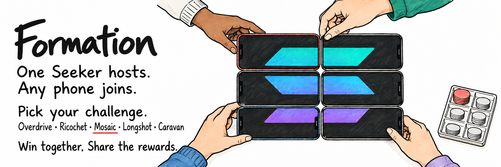
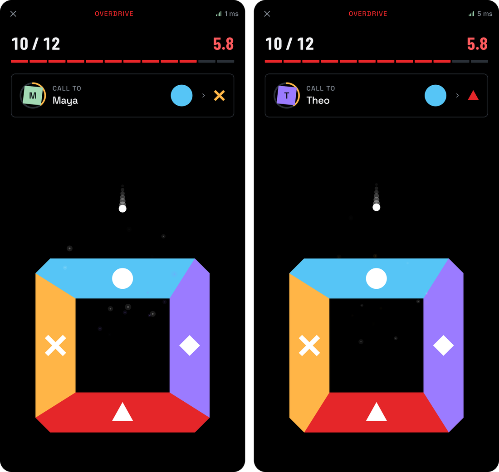
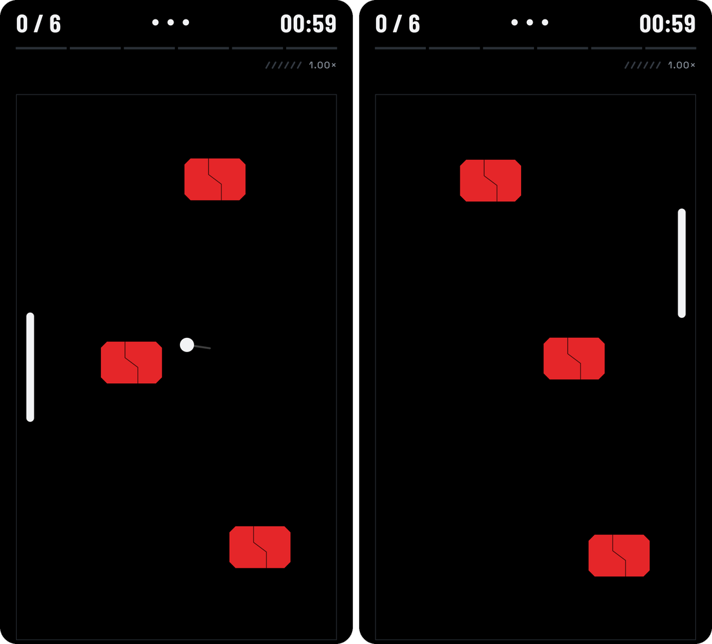
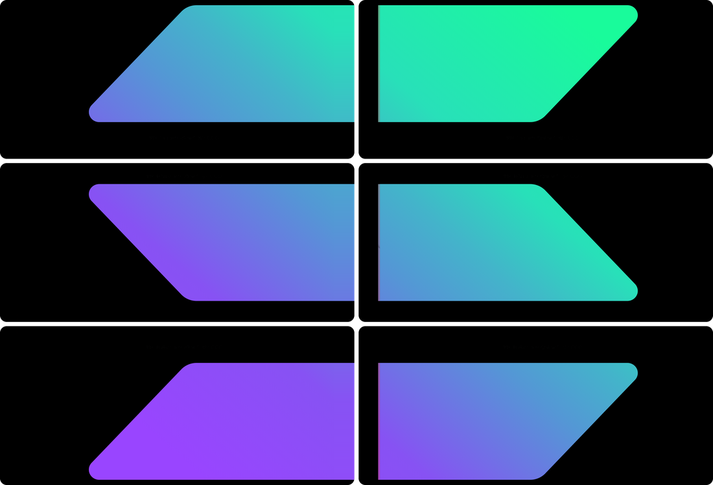
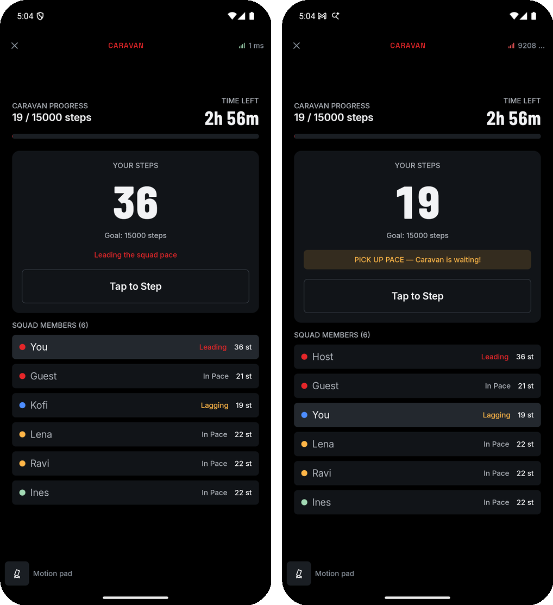

# Formation

Formation turns the phones in a room into one shared game. A Seeker owner starts a Formation, nearby phones join over the local network, and the group plays a short cooperative challenge that only works if everyone does their part. When the group wins, a reward funded on Solana unlocks and is split between the host and every player.

The idea is that a Seeker is a key to a shared experience rather than a solo device: its owner brings people together, and anyone who helps earns a share, with no wallet needed to join.

## Index

- [Watch Formation](#watch-formation)
- [Try Formation](#try-formation)
- [How a Formation works](#how-a-formation-works)
- [SKR in Formation](#skr-in-formation)
- [ORE in Formation](#ore-in-formation)
- [Why groups come back](#why-groups-come-back)
- [Games](#games)
- [Architecture](#architecture)
- [Repository](#repository)
- [Building](#building)
- [Testing](#testing)
- [Trust model](#trust-model)
- [License](#license)

## Watch Formation

https://github.com/user-attachments/assets/d034e7f3-b810-4a21-ad08-d02b9500eea4

[Download in 4K](https://github.com/emeieiron/formation/releases/download/v0.1.0/formation-v0.1.0-demo.mp4)

## Try Formation

Trying Formation takes no build: the app runs against the vault already deployed on Solana devnet.

1. Download [`formation.apk`](https://github.com/emeieiron/formation/releases/latest/download/formation.apk) on each phone and open it. Android asks once to allow installs from your browser.
2. Put the phones on the same Wi-Fi network. Office and guest networks often block local discovery; the host can open a hotspot from its lobby instead.
3. On the phone that will host, tap **Want to host? Become a test Seeker** on Home, or **Become a test Seeker** in Settings. The phone gets a test Genesis Token and a little devnet SOL for fees.
4. Pick a game and a funded reward, then tap **Start Formation**. The other phones join from Nearby, by QR code or with the four-letter code.

Real Genesis Tokens only exist on mainnet, so on devnet every host, a Seeker owner included, uses a test token. Building from source is for changing Formation; see [Building](#building).

## How a Formation works

1. **A sponsor funds a contest.** SKR is locked in the Formation vault for Seeker Genesis Token holders.
2. **A Seeker owner hosts.** They pick a game and a funded budget. Nearby phones find the Formation on the local network, or join with a QR code or a four-letter code.
3. **The group plays.** The host's phone runs the game; every phone sees its part of it.
4. **Everyone seals the result.** Each phone signs the win, so no one can change the outcome or the list of players afterwards.
5. **The reward unlocks.** The owner approves the unlock in their wallet. Players with a connected wallet are paid immediately; the others keep a proof on the phone and claim later.

## SKR in Formation

SKR is what a Formation plays for. The reward is the reason the group gathers, and the vault decides who gets it.

- **Sponsors lock real SKR.** A contest's pool sits in the vault until groups win it. Whatever no one earns returns to the sponsor after the claim window.
- **Sponsors choose who can play.** A contest can be first come, reserved for one Seeker, or a draw that picks Seeker owners with verifiable randomness.
- **Genesis Token holders unlock it by hosting.** Owning a Seeker earns nothing on its own. The owner has to bring a group together and win.
- **Every player is paid.** The owner gets a set multiple of each guest's share, and the vault enforces a minimum guest share, so hosting pays and so does helping.
- **SKR reaches people without a wallet.** Each guest's share is committed on chain when the group wins. A guest with a wallet is paid then; one without keeps a claim on the phone and collects it later, so new people come away holding SKR.

The [rewards guide](docs/rewards.md) covers contest types, the split and claims in detail.

## ORE in Formation

[Longshot](docs/longshot.md) turns an ORE round into a party game. ORE runs a 5×5 board in rounds: miners deploy SOL onto tiles, and each round ends with one winning tile. In Longshot, one player picks a tile and mines it, and everyone else calls whether it will win.

- **Real mining.** The picker deploys 0.001 test SOL on their tile in ORE's current round, approved in Solflare. The transaction carries a memo that ties it to the Formation turn.
- **Checked on chain.** The host reads the finalized transaction and accepts the turn only if it contains exactly the expected deploy, for the picked tile and the current round. A turn without confirmed mining has no result.
- **Read from ORE.** The winning tile comes from the round's account, using the same derivation as ORE's program. Formation doesn't decide the outcome.
- **Proceeds stay with the miner.** **Recover proceeds** checkpoints the round and claims any SOL and ORE the miner earned back to their wallet.
- **A reusable client.** [`app/solana/ore`](app/solana/ore/README.md) is a Kotlin Multiplatform client for ORE's accounts and instructions. It derives addresses, builds deploy, checkpoint and claim instructions, and checks account owners, layouts and the cluster before trusting a read.

ORE isn't deployed on devnet, so Formation deploys ORE v3.8.25 there from pinned upstream sources (`ore`, `entropy` and `ore-mint`), unchanged apart from an instruction that initializes its accounts on a fresh cluster. `program/ore-devnet.json` records the upstream commits and the hash of each deployed binary. `scripts/ore_devnet.py` builds, deploys and verifies it. The [ORE worker](ore-worker/README.md), a Cloudflare Worker, resolves each round once it ends, so Longshot needs no machine left running.

## Why groups come back

- **There's a game for any group.** Five games cover everything from a pair at a desk (Overdrive, Ricochet) to a party of up to eight (Longshot), a table of six or nine (Mosaic) and a walking group of up to sixteen (Caravan).
- **It only works together.** Overdrive, Ricochet, Mosaic and Caravan each need every phone, so a win is something the group did, not something one player carried. Longshot adds a round of calls around a real ORE mine.
- **Joining is free.** Guests need the app and nothing else: no wallet, no account. They join from Nearby, a QR code or a four-letter code.
- **Rewards recur.** New contests keep budgets coming, a contest can let one token win more than once, and draws give every Seeker owner a chance.
- **Unclaimed winnings bring guests back.** A guest who won without a wallet has SKR waiting in the app until they connect one and claim it.
- **The game set grows.** New games plug into the same session and reward flow through the [game API](app/challenges/api/README.md), without touching the vault.

## Games

Five games ship today, using the shared session flow through the [game API](app/challenges/api/README.md). Longshot mines ORE on devnet with the picker’s test SOL; the other players make free predictions.

| Game | Players | In short |
| --- | --- | --- |
| [Overdrive](docs/overdrive.md) | 2 | Call out your partner's symbol and rotate your square to catch each pulse |
| [Ricochet](docs/ricochet.md) | 2 | Two phones form one arena; keep a pulse in play and clear the targets |
| [Mosaic](docs/mosaic.md) | 6 or 9 | Lay the phones out to rebuild the Solana mark and pinch every seam closed |
| [Longshot](docs/longshot.md) | 2–8 | One player picks 1–25; everyone else calls WIN or LOSE before ORE reveals its winning tile |
| [Caravan](docs/caravan.md) | 6–16 | Each player walks 15,000 steps; stay within 30 steps of the rear to finish together |

<table>
  <tr>
    <td width="50%"></td>
    <td width="50%"></td>
  </tr>
  <tr>
    <td align="center"><sub>Overdrive: wave 10 of 12, six seconds left</sub></td>
    <td align="center"><sub>Ricochet: two phones, one arena</sub></td>
  </tr>
  <tr>
    <td width="50%"></td>
    <td width="50%"></td>
  </tr>
  <tr>
    <td align="center"><sub>Mosaic: six phones, one mark</sub></td>
    <td align="center"><sub>Caravan: six to sixteen walkers, 15,000 steps each</sub></td>
  </tr>
</table>

## Architecture


- **Session.** The host's phone is authoritative: it admits players, keeps clocks in sync, runs the game rules and broadcasts signed state. Guests send inputs and draw what the host sends. Every phone signs the final result before anything settles.
- **Games.** Each game is a self-contained module with its rules and its screen. The session and reward code have no game-specific branches.
- **Rewards.** The vault program holds contests and pays out. It enforces who can unlock, the committed roster, the split, one payment per guest slot and refunds. It does not check the gameplay itself. See [Rewards and the vault](docs/rewards.md).
- **Hosting.** Only a phone whose linked wallet holds a Seeker Genesis Token can host. On a Seeker that's the Seed Vault Wallet, linked with one approval. On devnet, **Become a test Seeker** gives the phone its own test wallet with a test token instead; everything after linking is the same. Every joining phone checks the wallet's authorization and the reward on chain.
- **Identity and recovery.** Each install has its own claim key, separate from any wallet, protected by the Android Keystore with an encrypted local copy. Wins are saved before they settle, so a result survives a restart or a lost connection. Profile → Rewards → Reward recovery exports an encrypted backup.
- **Offline play.** Without Wi-Fi, the host can open a local hotspot from the lobby. Settlement waits until the host is back online.

### Repository

| Path | What's there |
| --- | --- |
| `app` | Kotlin Multiplatform app, games, shared libraries, and platform integrations |
| `program` | Solana vault program, integration tests, and program interface |
| `faucet` | Cloudflare Worker that gives test Seekers devnet SOL and a test Genesis Token |
| `ore-worker` | Cloudflare Worker that resolves rounds of the ORE devnet deployment for Longshot |
| `scripts` | Devnet setup, emulator helpers, end-to-end journeys |
| `docs` | How to play each game, and the reward system |

The app is Kotlin Multiplatform with Compose UI. Android is the main platform; iOS builds and runs the shared code but doesn't yet have wallet support or secure recovery.

## Building

### Prerequisites

- JDK 21 and the Android SDK (compile SDK 37)
- Xcode, for the iOS app
- Rust, the Solana CLI 4.1.2 and Anchor 1.2.0, for the vault program
- Python 3 and [uv](https://docs.astral.sh/uv/), for the scripts

### The app

```sh
cd app
./gradlew :androidApp:assembleDebug
```

There is one app. Debug builds add a motion pad and autoplay in Profile → Developer. The emulator network bridge works in both debug and release builds when running on emulators, so the published build can be tested across two devices with `scripts/emulators.sh link`.

The app talks to devnet and its faucet by default. Pass `-Pformation.rpcUrl=…`, `-Pformation.cluster=…` and `-Pformation.faucetUrl=…` to change them; a mainnet build has no faucet, so **Become a test Seeker** doesn't appear.

### The vault program

```sh
cd program
anchor build
```

After changing the program, copy `program/target/idl/formation_vault.json` to `program/formation-vault/idl/`; the Kotlin client is tested against it.

### Devnet

The vault, a standing test contest and the faucet are already live on devnet, so these steps are only for a fresh deployment. Deploy the program, then create the test SKR mint, a test Genesis Token group owned by the vault, and the vault config:

```sh
solana program deploy program/target/deploy/formation_vault.so \
  --program-id program/target/deploy/formation_vault-keypair.json \
  -u devnet -k ~/.config/solana/seekers-devnet.json
scripts/devnet.py setup
scripts/devnet.py contest --budget 300 --budgets 1000 --wins 3 --hours 2159 --title "Formation test contest"
```

[Rewards and the vault](docs/rewards.md) covers the faucet, the other contest types and the admin commands.

### Development workflow

1. Start two or more Android emulators.
2. `scripts/emulators.sh install` builds the debug app and installs it on every running emulator; `scripts/emulators.sh link` lets them find each other.
3. On the host emulator, tap **Want to host? Become a test Seeker** on Home.
4. Choose a game, pick its funded reward and tap **Start Formation**. Join from another emulator's Nearby list.

If emulator screens stop redrawing after animations, cold-start them with software graphics: `emulator -avd YOUR_AVD -gpu swiftshader -no-snapshot-load`.

## Testing

Run these before pushing; CI runs the same checks on every push and pull request.

```sh
# App: shared and Android tests, release lint, debug build
cd app
./gradlew testAndroidHostTest :androidApp:lintRelease :androidApp:assembleDebug

# iOS: shared tests on the simulator
./gradlew iosSimulatorArm64Test

# Vault program
cd ../program
anchor build
cargo test -p formation-vault

# Scripts
cd ../scripts
python3 -m unittest test_overdrive_driver test_mosaic_driver test_caravan_driver test_android_layout test_chain_verification test_verify_release_demo

# Cloudflare Workers, in faucet and in ore-worker
npm ci
npm run check
```

### End-to-end journeys

`scripts/e2e.py` drives real emulators through a whole Formation on devnet: the host becomes a test Seeker with the app's own button, hosts a budget from the standing contest, and the group joins, plays, seals and unlocks. It then checks the on-chain result and every payout.

```sh
scripts/e2e.py --title Ricochet --layout android
```

| Option | Use |
| --- | --- |
| `--driver overdrive \| mosaic \| caravan \| autoplay \| manual` | Who plays: a game-specific driver, the built-in autoplay, or you |
| `--caravan-checkpoint` | After early gameplay checks, seed a debug-only checkpoint at 14,999 steps each; verify the last steps, result, unlock, and devnet settlement. This does not verify a full-duration walk |
| `--caravan-smoke` | Check Caravan step counting, synchronization, and pack recovery without claiming a complete win or settlement |
| `--layout android-cli` | Read layouts through the supported Android CLI; suitable for Caravan and other journeys without reflex timing |
| `--play-timeout SECONDS` | Maximum wait for a win; Caravan defaults to 7,800 seconds to preserve its 15,000-step rules |
| `--players N` | Group size; one emulator per player |
| `--difficulty Easy \| Normal \| Hard \| Extreme` | For games that offer a choice |
| `--wallet ADDRESS \| connect` | Pay the guest's share to a wallet, or connect one through the wallet app |
| `--offline` | Cut the host's network at unlock and check it recovers |
| `--layout android` | Faster screen reads through the Android CLI |

Records of each run are saved under `program/target/e2e`.

## Trust model

The vault guarantees who can unlock, where every share goes, the split and that each share is paid once. It can't see the game itself, so a modified host app could submit a result that wasn't really played, and a claim key proves a phone, not a person. Weigh this against the size of the rewards before funding contests with real value.

## License

    Copyright 2026 McXross

    Licensed under the Apache License, Version 2.0 (the "License");
    you may not use this file except in compliance with the License.
    You may obtain a copy of the License at

       http://www.apache.org/licenses/LICENSE-2.0

    Unless required by applicable law or agreed to in writing, software
    distributed under the License is distributed on an "AS IS" BASIS,
    WITHOUT WARRANTIES OR CONDITIONS OF ANY KIND, either express or implied.
    See the License for the specific language governing permissions and
    limitations under the License.
