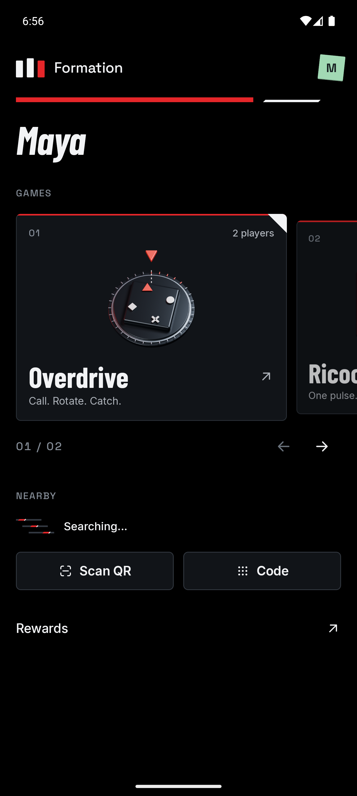
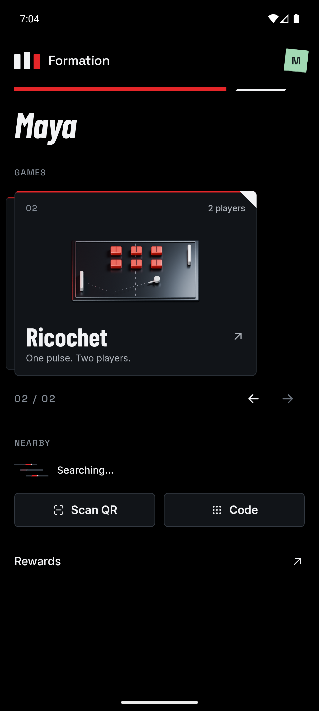
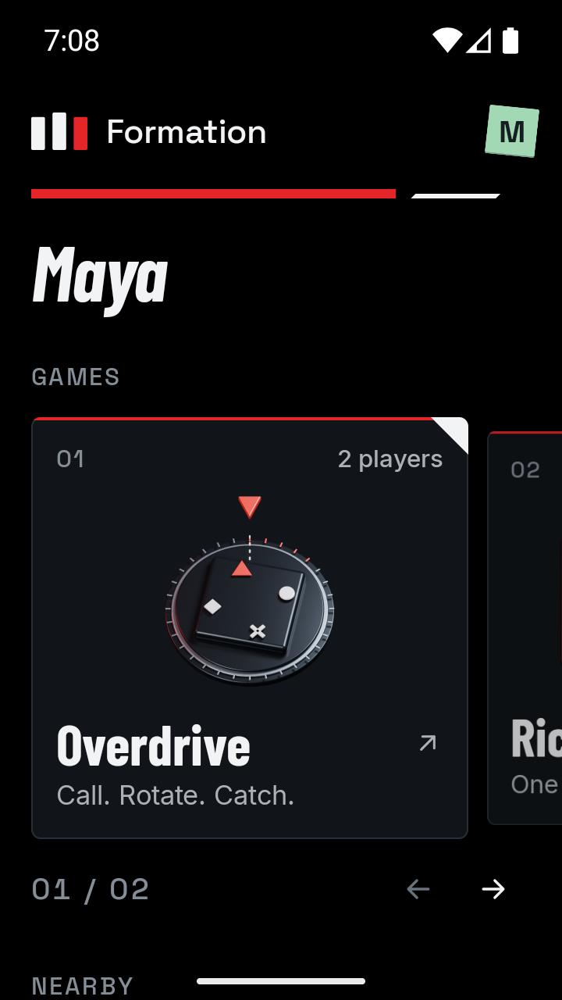

# Game discovery

Home exposes installed games independently of reward funding. Players can learn the controls before a Seeker hosts a Formation, including when the phone has no wallet, no rewards, or no internet connection.

## Implementation

- Populate the Games section from `ChallengeCatalog.all`; new registered modules appear automatically.
- Use a horizontal card deck with a focused card, neighboring-card preview, and a compressed stack behind the selection. Swipes snap to a game; arrow controls provide the same selection without dragging. Tapping a neighboring card selects it; tapping the focused card opens its preview.
- Keep metadata, supported player counts, instructions and optional interactive introductions available to guests. Games own their optional cover artwork; Home owns layout and navigation.
- Show matching funded rewards in the preview only for a linked host. Reject expired, settled, unsupported, and unrelated rewards; recheck the current selection before opening the existing reward sheet.
- Keep the current reward sheet, session setup, signing, and settlement flow. Browsing does not create a reward or start a game.
- Keep funding in its own Home section. The debug identity is labelled Test host so it is distinct from simulated reward funding.

## Verification plan

Build Android, run the focused reward-selection test, compile the shared iOS target, and run release lint. On emulators, inspect guest and empty-host Home, both previews, a compact display with larger text, and a matching funded reward opening the existing hosting sheet. Restore temporary preferences and display overrides afterward. Record executed checks below.

## Initial catalogue checks

Verified on 4 October 2026 with the debug APK installed on two Android emulators.

From `app`:

```sh
./gradlew :shared:testAndroidHostTest :androidApp:assembleDebug \
  :androidApp:lintRelease :shared:compileKotlinIosSimulatorArm64
```

All 35 shared host tests passed, including the new reward-selection boundary test. Android assembly, release lint and shared iOS compilation passed. The four existing Python driver and chain-verification tests passed, and `scripts/e2e.py` compiled successfully.

| Scenario | Observed result |
| --- | --- |
| Guest without a wallet, Seeker identity or rewards | Both games appear on Home; previews expose instructions without a hosting action. |
| Linked test host without rewards | Both games remain visible; Funded rewards reports No locked rewards. |
| Offline guest with the Solana ledger selected | Home and Ricochet's aiming preview remain available with Wi-Fi and mobile data disabled. |
| 360 × 640 dp display, 130% text size | Both game cards fit the initial viewport. Both previews scroll; instructions and Done remain accessible. |
| Ricochet and Overdrive reward fixtures | Ricochet's preview offers its 120 SKR reward and excludes Overdrive's 180 SKR reward. Selection opens the existing reward sheet and reaches Ricochet's lobby. |
| Existing reward-shelf driver | The driver distinguishes funded reward cards from catalogue cards and reaches Overdrive's lobby through the horizontal shelf. |
| Cleanup | Selected preferences, reward history, display overrides and connectivity settings were restored; preference and font-scale restoration were checked. |

Hosting checks used explicit simulated fixtures and stopped at the lobby. This pass verifies discovery and routing; [Ricochet's settlement verification](ricochet-escalation-verification.md) records the separate testnet payout checks.

| Guest Home | Matching funded reward | Compact instructions |
| --- | --- | --- |
|  |  |  |

## Card deck checks

Verified on 4 October 2026 with the updated debug APK installed on both Android emulators.

From `app`:

```sh
./gradlew :shared:testAndroidHostTest :challenges:api:testAndroidHostTest \
  :androidApp:assembleDebug :androidApp:lintRelease \
  :shared:compileKotlinIosSimulatorArm64
```

All 35 shared and two challenge API host tests passed. Android assembly, release lint and shared iOS compilation passed. The APK contains both module-owned cover resources. The original 1024 × 600 artwork and its editable Blender source are documented in [Cover artwork](../assets/covers/README.md).

| Scenario | Observed result |
| --- | --- |
| Guest without a wallet, Seeker identity or rewards | Home presents both registered games through the deck. |
| Swipe and arrow selection | Both gestures select and snap to the next game; the position indicator updates. |
| Card selection and preview | A neighboring card selects the game. The focused card opens its existing preview; closing it preserves the selection. |
| 360 × 640 dp display, 130% text size | Titles, artwork, player counts and arrow controls fit. Nearby and its join controls remain reachable by vertical scrolling. |
| Matching funded reward | Ricochet's preview offers its 120 SKR fixture and excludes Overdrive's 180 SKR fixture. The existing reward sheet reaches Ricochet's lobby. |
| Cleanup | Temporary preferences, reward history, display overrides and font scale were restored and checked. |

The tested emulators use `skiagl`. Partial frame updates caused unchanged Home regions to disappear after animation while the accessibility tree remained intact. Disabling `debug.hwui.use_partial_updates` and relaunching restored complete frames. The emulator installer applies this development setting when that renderer is active; the APK does not change device rendering settings.

Hosting checks used simulated fixtures and stopped at the lobby. No settlement was performed during this visual pass.

| Overdrive | Ricochet | Compact display |
| --- | --- | --- |
|  |  |  |

## Follow-up

Reward-free practice rounds, playable Overdrive tutorials, and funding-management UI are separate features. The catalogue explains installed games; a shared attempt still needs an existing funded reward and the normal Formation flow.
