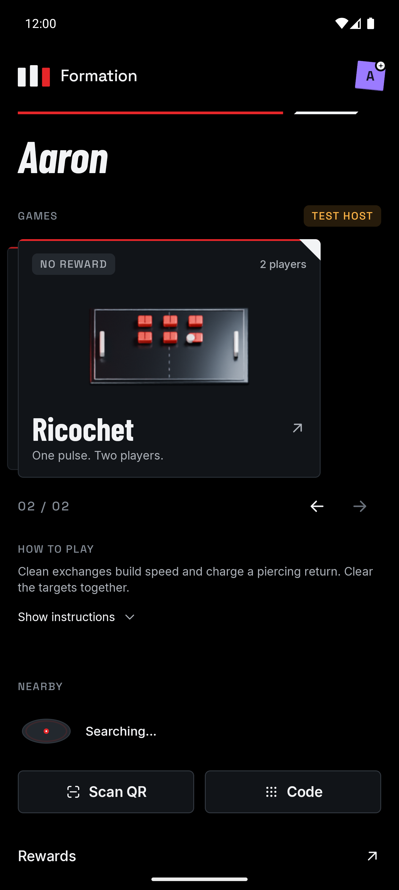
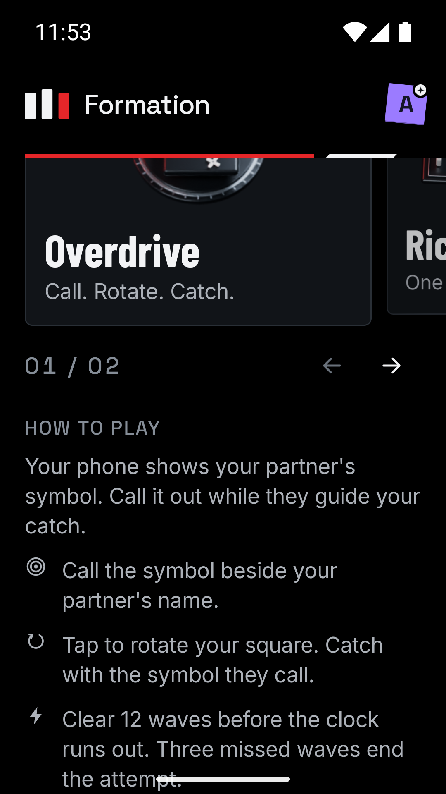
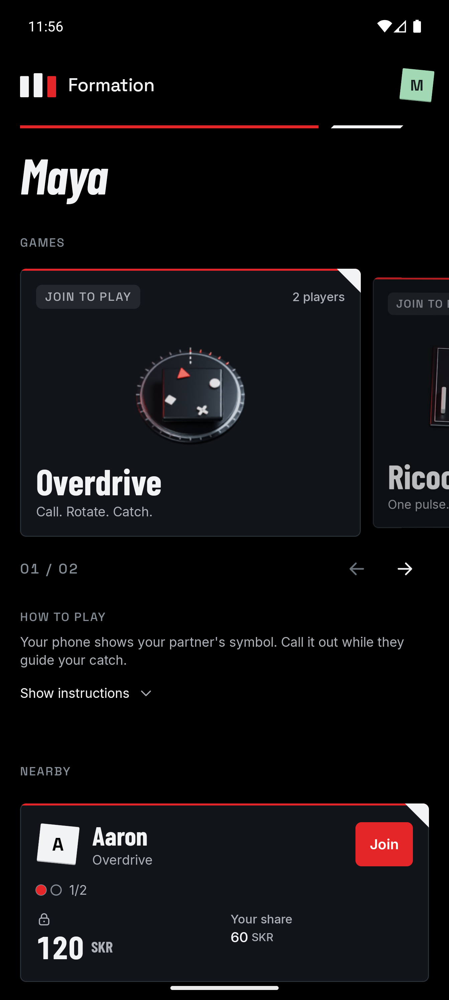

# Home motion implementation plan

## Objective

Give Home a distinct sense of movement while preserving readable game metadata, immediate navigation, accurate discovery state, and offline browsing. Reuse Formation's black/red/white Blender artwork.

## Build sequence

1. **Animated covers:** derive short Overdrive catch and Ricochet exchange demonstrations from the existing cover scenes. Render transparent sprite sheets at a bounded resolution. Preserve the existing stills and source scene. Use a shared Compose player; only the selected, visible game loads its sheet and advances frames. Hold the completed demonstration before repeating.
2. **Swipe depth:** move artwork relative to its card and add a shallow card tilt driven by pager offset. Keep text readable and provide the same selection through existing arrow controls.
3. **Short instructions:** show the selected game's summary by default, with an accessible Show instructions / Hide instructions control revealing all existing steps. Reset expansion when selecting another game.
4. **Opening sequence:** assemble the Formation mark, extend its divider, and settle the deck over approximately 520 ms. Remember completion for the current app UI session so ordinary returns Home do not replay it.
5. **Nearby:** show an abstract signal platform during active discovery, stop its animation on discovery failure, and animate newly discovered cards and occupancy changes using actual beacon state. Do not invent player location or distance.
6. **Rewards:** use the existing Blender reward pass in the ready-reward banner. Tilt and highlight it once when a newly ready entitlement appears, then rest. Keep amount and claim action in Compose.

## Motion policy

- Pause ambient animation when Home is not current, the app is backgrounded, a sheet is open, or its content is off screen.
- Respect the platform animation scale. At zero, show complete static UI with no sprite playback, parallax, or reveal delay.
- Read continuously changing frame and pager values during drawing wherever possible.
- Keep artwork decorative; expose text, selection, instructions, occupancy, and actions through accessibility semantics.
- Preserve game practice, funded reward selection, QR/code joining, and wallet/settlement behavior.

## Acceptance and verification

- Inspect Blender sample frames and confirm a clear catch/exchange, consistent materials, transparent edges, and stable cameras.
- Record sheet dimensions, compressed size, and decoded memory cost.
- Build Android, run relevant existing shared/API tests, compile shared iOS, and run release lint.
- Inspect both games, swipe and arrow selection, collapsed/expanded instructions, practice, navigation return, QR/code controls, discovery failure/arrival, and a ready reward.
- Check 360 × 640 dp with 130% text, system animation scale zero, and background/foreground behavior.
- Restore temporary device settings and record executed checks and any hardware limitations in this document.

## Implementation

All six steps are implemented. Game modules continue to own their cover resources through the existing API. `LocalArtworkActive` lets Home supply visibility without adding game-specific branches or changing game rules. `MotionCover` reads a quantized frame index during drawing, avoiding 60 fps canvas redraws for a 12 fps sheet. Loading and disabled-motion paths retain the original still artwork.

The card's artwork is a separate visual layer from its text and backing panel. Pager offset shifts it up to 18 dp and rotates it up to 2.5 degrees; the backing card receives a shallow three-degree tilt. This supplies depth without a runtime 3D engine. The mark, divider, and deck share one 520 ms entry animation. UI-session history prevents ordinary navigation returns from replaying it.

Nearby arrivals and reward reveals are tracked by session ID and entitlement identity respectively. Occupancy fills follow beacon changes. Failed discovery displays Discovery paused and a stationary platform. No visual position represents physical location. The ready-reward pass tilts and receives a single highlight sweep before resting.

The Blender [motion source](../assets/covers/formation-covers-motion.blend), [render script](../assets/covers/animate.py), and [packing script](../assets/covers/pack.py) reproduce the shipped sheets without changing the original stills. The two sheets total 1,476,108 bytes compressed. Each is 1944 × 1152 pixels, or 8,957,952 bytes (8.54 MiB) decoded as RGBA. The resource cache may retain both after both games have been selected; only the selected visible cover advances.

## Executed checks

Completed on 5 October 2026 using two existing Android emulators.

```sh
cd app
./gradlew :shared:testAndroidHostTest :challenges:api:testAndroidHostTest \
  :androidApp:assembleDebug :androidApp:lintRelease \
  :shared:compileKotlinIosSimulatorArm64
```

All 35 shared tests and three challenge API tests passed. Android assembly, release lint, and shared iOS compilation passed. The render/packing scripts passed Python syntax checks; the Blender renders completed and representative catch/hit frames were visually inspected. `git diff --check` passed.

| Check | Observed result |
| --- | --- |
| Both covers, arrows, and swipe selection | Demonstrations play; swipe changes selection and artwork depth; selected-game summary follows selection. |
| Instructions | Show instructions reveals all original steps; Hide instructions collapses them. Selecting another game resets expansion. |
| Ricochet practice | Selected card reaches interactive aiming and Done returns to Home. |
| Code entry | Code opens the existing join sheet; Back closes the keyboard and then the sheet. |
| System animation scale zero | Original still cover appears and discovery motion stops; labels and controls remain visible. |
| 360 × 640 dp, 130% text | Card content and arrows fit; all instructions, their toggle, Nearby, Scan QR, Code, and Rewards remain accessible through vertical scrolling. |
| Simulated ready entitlement | Banner displays the Blender reward pass, 60 SKR, and one ready reward. |
| Simulated funded reward | Playable Overdrive opens its matching 120 SKR reward, hosting sheet, and existing lobby. |
| Nearby arrival | Second emulator discovers the lobby and displays the correct host, game, 1/2 occupancy, 120 SKR reward, and 60 SKR helper share. |
| Navigation and app return | Practice, code entry, session exit, and background/foreground return preserve a working Home. The initial assembly is retained as completed during ordinary UI navigation. |
| Cleanup | Test lobby ended. Original ledger, simulated rewards, and ticket data were restored and compared with their backups. Size/density overrides were cleared; font and animator scales were restored to 1.0. Existing emulator forwards were unchanged. |

The final APK is installed on both emulators. [Twenty-second cover and swipe preview](images/home-motion.mp4).

| Home | Compact expanded instructions | Nearby arrival |
| --- | --- | --- |
|  |  |  |

## Verification limits

Physical-device frame pacing, battery cost, and physical-network behavior were not measured. Shared iOS compilation passed; iOS runtime visuals were not exercised. Discovery-failure rendering and occupancy transitions were reviewed in code, but this pass did not force a discovery failure or observe an occupancy change while Home remained visible. Hosting used isolated simulated fixtures and stopped at the lobby; no gameplay settlement or wallet operation was performed.
