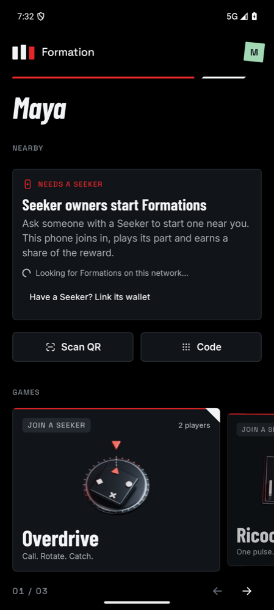
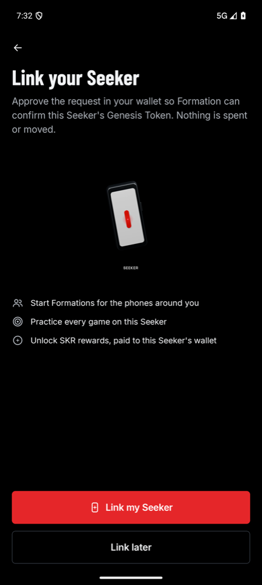
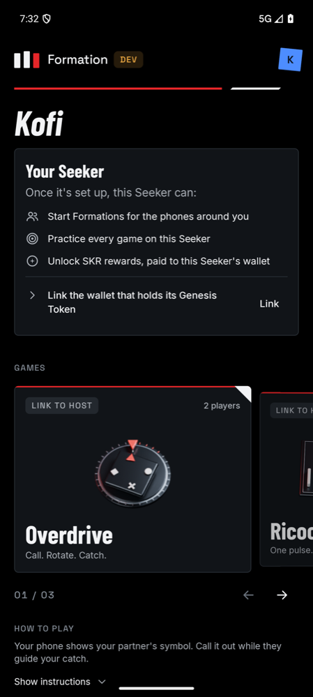
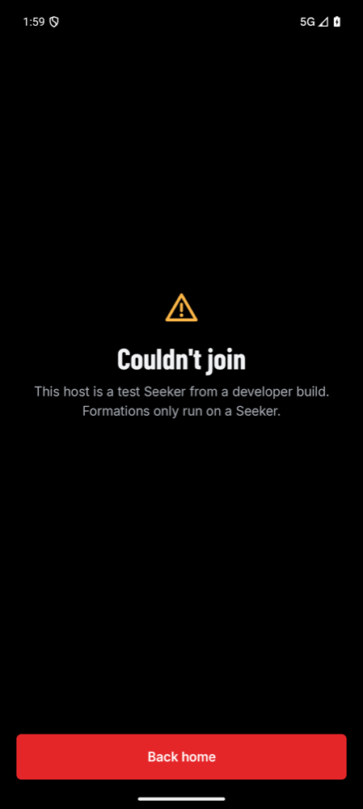

# Hosting, joining and rewards

Who can start a Formation, how every other phone checks the host, and where rewards go. The Seeker Genesis Token (SGT) wallet gates hosting, not the phone's hardware. The hardware attestation is kept for a later [Seeker present badge](seeker-presence.md).

## Who can host

In the `prod` build, a phone can host if its linked wallet holds a Seeker Genesis Token. The phone itself doesn't have to be a Seeker. Hosting also needs a reward funded on chain for that same wallet. Practice follows the same rule.

## Linking a wallet

Linking asks the wallet for one approval, through Mobile Wallet Adapter. The wallet signs this text:

```
Formation: let this phone host Formations for this wallet. It can't move funds.

Host key: <a key Formation keeps on this phone>
Network: devnet
Issued: 2026-10-05
```

- The signature is checked against the wallet's address, so a wallet app can't name an address it doesn't hold.
- The wallet must hold a token in the group the vault accepts on this network: Solana Mobile's group on mainnet, the test group on devnet. The app reads the group from the vault's own config, so the app and the vault always agree. Emptied token accounts don't count.
- The signed text authorizes the host key, which is the only wallet approval hosting needs.
- Formation rechecks the token on every launch and unlinks the wallet if the token is gone. Unlinking deletes the host key, so the old authorization can't sign anything on this phone.

## Every session

1. The host makes a session key and signs, with its host key, the session, the session key and the reward's full terms.
2. It sends the wallet's signed authorization and that signature to each phone that connects (`HostProof`).
3. Each joining phone checks:
   - the wallet's signature on the authorization;
   - that it names this host key and this network;
   - the host key's signature on this session and reward.
4. Each joining phone fetches the reward from the vault. It must exist, be open, name that wallet and match the terms the host shows. A guest that can't reach the network, such as on the Seeker's own hotspot, joins without this check; its claim checks the chain later.
5. The session key signs the welcome and every update. Guests leave if a signature doesn't check out, or if an update shows a different reward.

A copied proof is useless to another phone, because it can't sign updates with the session key.

## Rewards

- The vault funds rewards only for a wallet holding a Genesis Token, and only that wallet can unlock them. The host's share goes to that wallet. Unlocking needs the wallet's signature; the host key can't move funds.
- The vault records the token's mint on each reward. A sponsor offering one reward per Seeker dedupes by that mint, not by wallet, so moving the token to another wallet doesn't earn a second reward. `scripts/devnet.py drops` does this for each game.
- Any phone can join a Formation and earn a share without a Seeker or a token.

## What each phone sees

| | Phone that isn't a Seeker | Seeker hardware, not linked | Linked wallet, any phone |
| --- | --- | --- | --- |
| Onboarding | Story, profile, then Home | Story, profile, then **Link your Seeker** | — |
| Home opens on | **Nearby**, with a note that Seeker owners start Formations and a small **Have a Seeker? Link its wallet** link | **Your Seeker**: what a Seeker can do and a checklist (wallet linked, reward funded), then games | Games. The checklist stays until a reward is funded. |
| Game cards | **Join a Seeker** | **Link to host** | **No reward** or **Playable** |
| Settings | **Have a Seeker? Link its wallet** | **Link this Seeker** | The wallet and token, **Check again** and **Unlink** |

Linking is never an onboarding question on a phone that isn't a Seeker. Seeker hardware is detected from its build properties, which only choose the path.





## Builds

| Flavor | Installs as | Hosting |
| --- | --- | --- |
| `dev` | **Formation Dev** (`xyz.mcxross.formation.dev`) | Any phone can pretend to be a Seeker, and rewards can be simulated. Only other `dev` builds join a pretend host. |
| `prod` | **Formation** (`xyz.mcxross.formation`) | A linked wallet. No developer tools in the interface, and it refuses pretend hosts. |

Release CI builds `prodRelease` and refuses any other flavor. Developer tools, in Profile → Developer of a `dev` build:

- **Pretend to be a Seeker**, also offered on Home's join panel.
- **Seeker hardware attestation**: runs the [hardware check](seeker-presence.md) on this phone.
- **Act as Seeker hardware**: shows a Seeker's onboarding on any phone after a restart.
- **Solana ledger** off: simulated rewards.



## Network

Formation runs on devnet, where ORAO's verifiable randomness is available for [sponsor contests](sponsor-contests-plan.md). The vault program is deployed there and `program/devnet.json` records its test SKR mint and test Genesis Token group.

## Verification

Verified on 5 October 2026:

- 229 host tests pass. They cover the authorization chain (wrong wallet, other phone, other network, other session, changed reward terms), the session flow (no proof, a copied proof, altered and unsigned updates), linking and unlinking, and phone roles.
- On devnet, two emulators ran Ricochet with a pretend host. `scripts/devnet.py` gave the host a test Genesis Token and locked a 120 SKR reward. The phones joined, played and unlocked, and the owner's 60 SKR settled on chain. A second `drops` skipped the game because the token already had an open reward.
- A `prod` build on a phone that isn't a Seeker opened on the join panel with the link, and a `dev` build acting as Seeker hardware showed the onboarding and checklist above.

Not yet exercised: linking a real wallet through Seed Vault, and a real host proof between two phones. Both need a wallet app; the authorization chain is covered by the host tests.
