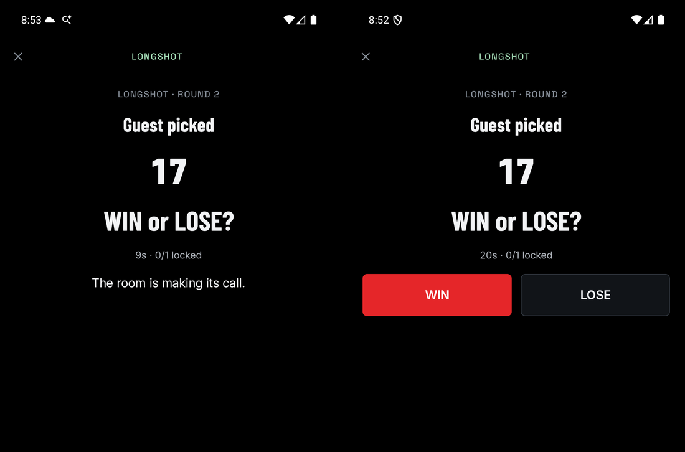

# Longshot

**Players:** 2–8 · **Goal:** correctly predict whether the picked number matches ORE's winning tile

## Setup

- A Seeker hosts Longshot; the other phones join the Formation.
- Each turn randomly selects one player to pick a number and fund the mining. Everyone else predicts for free.
- The selected player needs Solflare and at least 0.011 test SOL for the 0.001 test SOL stake, account rent, and fees. Unused funds stay in the wallet.
- Connect the wallet in the mining step. If funds are needed, tap **Get test SOL**. If funding fails, use **Open faucet**, copy the wallet address, then return and refresh the balance.

## Each turn

1. The selected player has 30 seconds to pick one tile from 1–25.
2. Everyone else has 20 seconds to call **WIN** if that number will match ORE's winning tile, or **LOSE** if it won't.
3. Predictions lock and are revealed. The selected player approves **Mine with 0.001 test SOL** in Solflare.
4. Wait for ORE to reveal its winning tile. A match is WIN; any other tile is LOSE. The result shows which predictions were correct.
5. The host taps **Next round** to select another player and play again.

## Rules

- A picked number and a locked prediction cannot be changed. Other players' predictions remain hidden until the calls close.
- Missing the picking deadline skips the turn. Missing the prediction deadline records no prediction.
- Cancelling wallet approval leaves the mining step available to retry. A turn without confirmed mining has no WIN or LOSE result.
- The host can skip a delayed turn. Skipping or leaving cannot cancel mining already submitted.
- A matching tile does not guarantee an individual ORE payout. Use **Recover proceeds** on the result or on Home to return any available mining proceeds to the wallet.
- This version uses test SOL and test ORE, which have no monetary value. Predictions have no entry fee or token reward.
