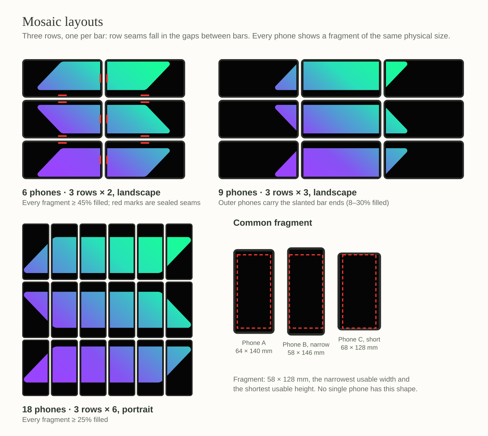

# Mosaic plan

Mosaic is a cooperative puzzle for 6, 9 or 18 phones. Each phone shows one fragment of the official Solana logomark at true physical size. Players lay the phones on a table in three rows until the fragments form the complete mark, then seal every seam with a pinch across it. The host checks each pinch against the dealt layout. Sealing every seam before the deadline wins the round.

Register `mosaic` with vault code `8` and format version `1`.

## Group sizes

The official logomark is 101 × 88 units: three bars 21.79 units tall, separated by two 11.31-unit gaps. Cutting it into three equal rows puts both row seams inside those gaps. No seam runs along a bar, and the bezels between rows cover only empty space. Every supported layout therefore has three rows, one per bar. The number of columns depends on how the phones lie.

| Phones | Grid | Orientation | Smallest fragment fill | Mark on typical phones |
| --- | --- | --- | --- | --- |
| 6 | 3 × 2 | Landscape | 47% or more | About 24 × 21 cm |
| 9 | 3 × 3 | Landscape | 6–28%; outer phones carry the slanted bar ends | About 24 × 21 cm |
| 18 | 3 × 6 | Portrait | 22% or more | About 43 × 37 cm |

Fill is the share of a phone's fragment covered by the mark, measured by the shipped layout code with seam gaps. The mark sizes assume a usable area of 147.6 × 66.5 mm. Nine phones produce the same mark as six; the extra phones make the puzzle harder rather than the mark larger.

Other counts fail for common phone shapes. Twelve phones work only on 16:9 screens, 15 fail on 21:9 screens, 24 fail on 16:9 screens, and 21 leave a nearly empty fragment on 16:9 screens. Counts that aren't divisible by three can't keep one bar per row.

These figures come from rasterizing the official SVG over usable screen shapes from 1.6:1 to 2.4:1. That range covers 16:9 phones after system insets through 21:9 phones. The layout engine's tests repeat this sweep.

## Fragment size across phones

Before each round, every phone reports a screen profile: its physical display size in millimetres, safe insets for cutouts and rounded corners, and pixels per millimetre on each axis.

- **Common fragment.** The host takes the per-axis minimum of every phone's usable area in the layout's orientation, which means the narrowest usable width and the shortest usable height. This is the largest rectangle that fits every phone. Using the smallest phone's aspect ratio instead wastes space when one phone is the narrowest and another the shortest (diagram, right).
- **Physical scale.** Every phone draws its fragment at the same size in millimetres, using its own pixel density, so a 6.7-inch phone and a compact phone show identical pieces. Compose density-independent pixels are not physical units and are not used for this.
- **Anchoring.** Each fragment sits against the side of the screen that faces its neighbour, which keeps the image tight across seams. A phone with neighbours on both sides of an axis centres its fragment on that axis. The deal gives those positions to the phones whose screens are closest to the fragment size, so larger phones' spare screen ends up at the outside of the mosaic.
- **Bezels.** The mark is laid out as one canvas viewed through windows, with a nominal gap at each seam for bezels and cases. Content behind the bezels is hidden instead of shifted, so bars keep their true length and slanted edges stay straight. At row seams, only the empty space between bars is hidden. The nominal gaps start at 6 mm between long phone edges and 10 mm between short edges, and playtests set the final values. Players align the phones by eye.
- **Floor.** Mosaic turns away a phone whose usable area is below 90 × 45 mm, so one tiny screen can't shrink everyone's fragment. A tablet can join; its fragment uses only part of the screen.

On Android, the profile describes the full-screen stage window: the maximum window metrics minus `DisplayCutout` safe insets and `Display.getRoundedCorner` radii, with a conservative inset before API 31. Density comes from `DisplayMetrics.xdpi` and `ydpi`. Some devices misreport these values, so a profile is rejected when its pixels aren't square within 5% or its diagonal falls outside 4.5–8 inches. A rejected phone can calibrate once by matching an on-screen outline to any ID-1 card, which is 85.6 mm wide. Bank, transit and ID cards all work, and only the card's edge is used. The device stores the result. In split-screen or multi-window mode, the profile is unavailable until the app returns to full screen.

iOS has no public API for physical screen size, so iOS phones can't join Mosaic until a device model table exists.

## Play

1. **Deal.** At go, each phone shows its fragment and the stage hides the system bars. The activity stays portrait-locked; landscape layouts draw the fragment rotated. On Easy, each fragment is labelled, for example "Top bar · left end". Screen readers get the label on every difficulty.
2. **Assemble.** Players lay the phones in three rows and slide them until the bars line up.
3. **Seal.** A pinch across a seam seals it. Put one finger on each phone, starting inside both screens, and slide them toward the shared edge together. One person can use a thumb and a finger, or two people can use one finger each. The facing edges of both phones light up.
4. **Complete.** When every seam is sealed, a light sweep crosses the whole mark. It is timed with the shared clock, so it travels from phone to phone. The round is won.

The Home instructions are "Each phone holds one piece of the Solana mark", "Lay the phones in three rows until the bars line up" and "Pinch across every seam to seal it before time runs out".

### Sealing rules

Each phone reports its half of a pinch: the edge the finger moved toward, the finger's position along that edge in millimetres, and the host times of touch-down and release. The host pairs halves from two phones whose releases fall within 150 ms of each other and whose edges face each other. It then uses the dealt layout to map both positions onto the canvas:

- **Neighbours that agree within tolerance:** the seam is sealed.
- **Neighbours that disagree:** both phones show "line it up". There is no penalty.
- **Phones that aren't neighbours on those edges:** this is a wrong seam and costs a shared miss on every difficulty.
- **Unpaired halves** expire silently after 400 ms. Stale, duplicate and unknown-player halves are ignored.

Pinches start inside the screen and move outward. Android's back and home gestures begin with a swipe inward from an edge, so pinches don't trigger them, and the shipped stage doesn't need gesture exclusion.

A seal proves that two phones were adjacent and aligned at that moment, not that the mosaic stayed assembled. A later version could unseal a phone when it is lifted, using optional motion sensors with touch-only play as the fallback.

### Difficulty

| | Easy | Normal | Hard | Extreme |
| --- | --- | --- | --- | --- |
| Deadline | 20 s + 9 s per seam | 20 s + 7 s per seam | 20 s + 5 s per seam | 20 s + 4 s per seam |
| Hints | Fragment labels, unsealed seam marks | Unsealed seam marks | Sealed seams only | Sealed seams only |
| Alignment tolerance | 8 mm | 8 mm | 6 mm | 5 mm |

Six phones have 7 seams, nine have 12 and eighteen have 27. On Normal, six phones get 69 seconds. Three wrong seams end the attempt.

Each phone draws the time, misses and sealed-seam count in the emptiest corner of its fragment. The layout engine picks that corner from the strip of gap above or below the bar, so the HUD never covers a bar.

## Framework changes

None of these changes adds a game-specific branch.

- **Screen profiles.** Add a `ScreenProfile` model and a platform port, with the Android implementation described above. Extend the readiness report (`ToHost.Sensors`) with an optional profile. The host stores the profile per seat, and `ChallengeSetup.screens` freezes the profiles at start, so the deal is ready in the opening frame.
  - A game opts in with a screen requirement. This adds a `display.physical.v1` admission capability, so phones that can't measure their screen are turned away when they join. Readiness then waits for a plausible profile from every phone.
  - The new field is optional, and older apps never reach Mosaic because its format version rejects them. `PROTOCOL_VERSION` stays at 4, and Overdrive and Ricochet are unaffected.
- **Stage services.** `StageScope.screen` exposes the local profile, so the stage can draw in millimetres. A game flag asks the session shell to hide system bars during play and restore them afterwards.
- **Discrete group sizes.** `ChallengeInfo.players` is an `IntRange`. Add an explicit set of supported sizes that defaults to the range. Use it in `ChallengeRegistry.supports`, the hosting check in `AppGraph` and the Home label ("6, 9 or 18 players"). Rewards for other sizes are rejected like any unsupported reward.
- **Journey driver.** `scripts/e2e.py` drives one Seeker and one guest. Generalize it to a list of guests, and add `--driver mosaic`.

## Module boundaries

The paths below are relative to `app/challenges/mosaic/src/commonMain/kotlin/xyz/mcxross/formation/mosaic`.

| File | Responsibility |
| --- | --- |
| `Mosaic.kt` | Metadata, group sizes, serializers, stage binding and debug assistance |
| `Artwork.kt` | Official logomark paths, gradient stops and view box; the only file to change for another image |
| `Layout.kt` | Grids per group size, the common fragment, coverage and seam checks, canvas windows and nominal gaps |
| `Deal.kt` | Seeded, size-aware assignment of phones to positions |
| `Seams.kt` | Pinch halves, the pairing window and alignment tolerance |
| `MosaicGame.kt` | Host lifecycle: deadline, misses, seals and completion |
| `ui/FragmentCanvas.kt` | Physical-scale drawing, landscape rotation and the shared gradient |
| `ui/PinchInput.kt` | Edge-directed drags tracked per finger, with local feedback |
| `ui/SealGlow.kt`, `ui/Reveal.kt` | Seal lights and the synchronized sweep |
| `ui/MosaicHud.kt` | The corner HUD |
| `ui/PinchIntroduction.kt` | Briefing practice: pinch across a simulated seam without sending inputs |

The rules read only the setup (roster, seed and screen profiles) and the supplied `now`.

## Assets

The Home card cover is rendered in Blender, following `assets/covers`. Add a Mosaic scene to `assets/covers/render.py`: an orthographic top-down view of six phones of mixed sizes on a dark surface forming the mark, with two seams lit red. It renders a transparent 1024 × 600 PNG that the module owns. The screen textures come from the game's own layout code, so the cover shows real fragments. The script also regenerates `formation-covers.blend`.

The layout diagram in this plan was generated from the official SVG. Once the Kotlin layout engine exists, its tests take over that analysis.

## Artwork

The artwork is `solanaLogoMark.svg` from [solana.com/branding](https://solana.com/branding), with its six-stop gradient from `#9945FF` to `#19FB9B`. Mosaic draws the vectors at native resolution, on black, scaled uniformly so the fragments line up. Mosaic does not follow the full Solana brand guidelines. The artwork sits in one file, so another image can replace it.

## Commit phases

1. **Plan.** This document and the layout diagram.
2. **Screen profiles.** The model, Android measurement and plausibility checks, card calibration, readiness transport, `ChallengeSetup.screens`, the admission capability and `StageScope.screen`. Test the profile maths, plausibility boundaries, the readiness gate and multi-window changes.
3. **Group sizes.** Discrete sizes in the API, the registry, the hosting check and the Home label. Test that 6, 9 and 18 are accepted and that 7 and 12 are rejected.
4. **Rules.** The module, artwork parsing, layout engine, deal, seam pairing and lifecycle. Tests cover:
   - the coverage and seam sweep for aspect ratios from 1.6 to 2.4;
   - the per-axis minimum, the size floor and anchoring;
   - pairing windows, wrong and misaligned seams, and stale or duplicate halves;
   - the deadline, misses, completion and seeded replay.
5. **Stage and registration.**
   - Build the fragment drawing, full-screen stage, pinch input, seal glow, corner HUD, reveal and introduction.
   - Add haptics and sound cues for seal and wrong-seam events. The shipped stage reuses `Target`, `Miss`, `CloseCall` and `Danger`, so no new sound assets were needed.
   - Register the game. Build Android and compile the shared iOS target.
6. **Assets.** The Blender cover scene and the module-owned PNG.
7. **Demo and verification.**
   - Add an explicit six-player fixture, `scripts/fixtures/mosaic.json`.
   - Debug assistance is marked **AUTOPLAY**. Each phone sends its half of each seam at a host time scheduled from public state.
   - Run the generalized journey on six emulators or adb-connected phones through sealing and simulated settlement. Then settle on testnet with five helpers.
8. **Physical playtest.** Use six real phones of mixed sizes:
   - Measure each fragment with a ruler.
   - Check bar alignment, pinch success rate and false pairs.
   - Confirm that system gestures stay out of the way, and note brightness differences.

   Then tune the nominal gaps, tolerances and deadlines. Enable 18 phones only after an 18-phone session.
9. **Documentation.** Shipped behaviour, module boundaries and executed checks, distinguishing simulation, emulators and physical phones.

## Acceptance criteria

- On mixed phones, every fragment measures the same physical size within ±1 mm, and the bars line up across seams when placed by eye.
- For every supported size and every usable aspect ratio from 1.6 to 2.4, the layout engine never deals a fragment below its coverage floor and never places a seam along a bar.
- A phone without a plausible profile is turned away at admission or held at readiness with a clear message. A round never starts with missing profiles.
- One pinch seals at most one seam. A wrong seam costs exactly one shared miss, and misalignment costs nothing. Stale and duplicate halves change nothing.
- Sealing every seam before the deadline wins exactly once. The deadline or the third miss loses.
- Overdrive, Ricochet, the protocol version and the session flow are unchanged apart from the generic additions above.

## Risks and limits

- Some Android devices report the wrong pixel density. Plausibility checks and card calibration cover this, but each new device family needs a ruler check.
- Bezels and cases vary. The nominal gaps and alignment by eye absorb most of the difference, but large bezels widen the spacing between bars.
- Neighbouring screens differ in brightness and colour. The stage can request a fixed window brightness, but it can't override Night Light or Extra dim.
- No session has run on devices with more than two phones. Lobby layouts, discovery and readiness with 6–18 phones, and settlement across many helpers, all need explicit checks.
- Eighteen phones need a table of about 50 × 50 cm.
- iOS phones are excluded until iOS can report physical screen size.

## Progress

Phases 1–7 and 9 are complete on the `mosaic` branch as of 5 October 2026. Phase 8 needs physical phones.

- [x] Plan and layout diagram.
- [x] Screen profiles, card calibration, the readiness gate, `ChallengeSetup.screens`, `StageScope.screen` and counted full-screen stages.
- [x] Discrete group sizes in the API, registry, hosting check and Home label.
- [x] Rules: artwork, layout, deal, pairing and lifecycle, with 25 focused tests.
- [x] Stage, pinch input, HUD, sweep, feedback, practice and registration.
- [x] Blender cover and motion sheet.
- [x] Six-emulator journeys with debug assistance and with real touch swipes through sealing and simulated settlement.
- [ ] Physical playtest with six mixed phones: ruler checks, alignment, pinch reliability, brightness, then tuning.
- [ ] An 18-phone session, then add 18 to `Layouts.groupSizes`; until then rewards can fund 6 or 9 phones.
- [ ] Testnet settlement for a six-player reward.

The [implementation guide](mosaic.md) records shipped behaviour and module boundaries. The [verification record](mosaic-verification.md) separates host tests, emulator runs and the checks still waiting for phones.
