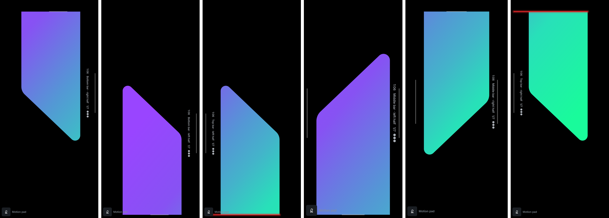
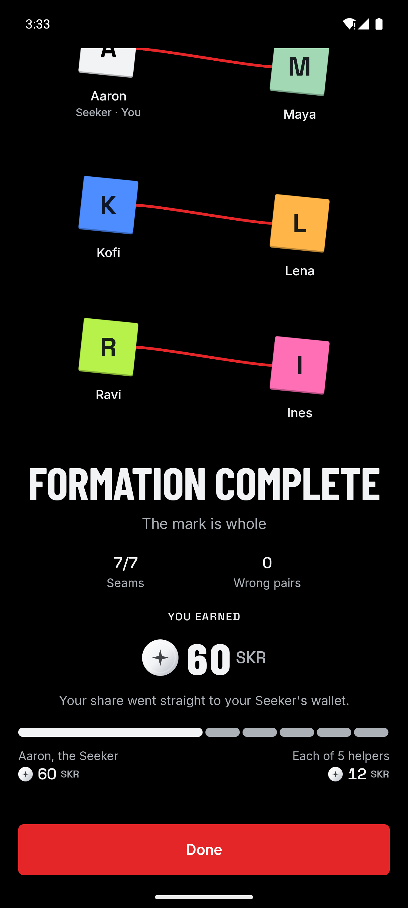
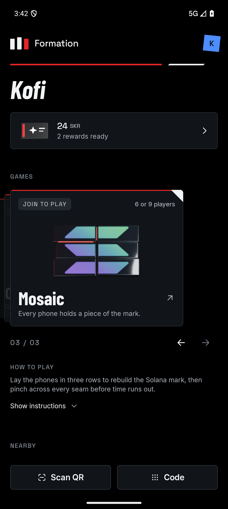
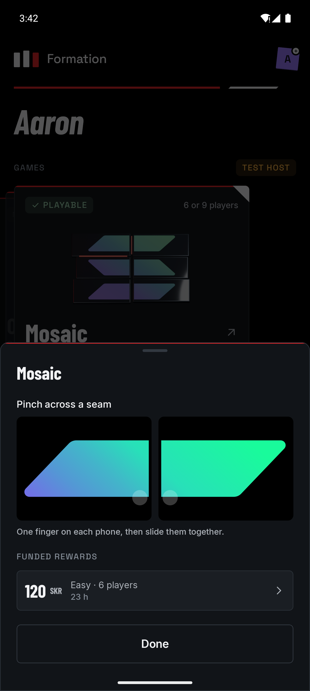

# Mosaic verification

Verified on 5 October 2026 on the `mosaic` branch. This record separates host tests, emulator execution and checks that still need physical phones.

## Builds and tests

From `app`:

```sh
./gradlew :challenges:mosaic:testAndroidHostTest :challenges:api:testAndroidHostTest \
  :core:session:testAndroidHostTest :shared:testAndroidHostTest \
  :shared:compileKotlinIosSimulatorArm64 :androidApp:lintRelease :androidApp:assembleDebug
```

All 93 host tests in those four suites passed, with no failures or errors. The shared iOS target compiled, and release lint reported only existing warnings.

| Suite | Coverage |
| --- | --- |
| `ScreenReadinessTest` | Admission turns away phones without the screen capability; readiness waits for an accepted profile; setup freezes each phone's profile; implausible readings are rejected |
| `ChallengeRegistryTest` | Declared group sizes must fall within the player range; only the declared sizes, such as 6, 9 and 18, match a reward |
| `LayoutTest` | Bars and gaps of the official artwork; per-axis shared piece size; landscape orientation; placement toward seams; coverage and row seams for every size across 1.6:1–2.4:1 screens; room for the HUD |
| `DealTest` | Seeded, complete deals; the phones with least vertical spare take the middle row; 18-phone deals |
| `MosaicGameTest` | Seals, alignment hints, wrong pairs after the settle window, simultaneous pinches, lone, stale, duplicate and outer-edge halves, the late stamp window, the third wrong pair, the deadline, a single win, difficulty hints, and debug assistance completing 6, 9 and 18 phones on every difficulty without a miss |
| `PinchReaderTest` | Slides toward seams become halves with the right edge and lift point; outer edges, short, diagonal and early lifts are ignored; IDs keep rising |

`python3 -m unittest test_mosaic_driver test_overdrive_driver test_chain_verification` passed in `scripts`.

## Six-emulator journeys

Six read-only instances of the `formation-release` AVD ran Android 16 at 1344 × 2992 and 480 dpi, with a 159-pixel camera cutout and 153-pixel rounded corners. Two instances were shrunk with `wm size 1080x2400` and `wm size 1260x2700` to give three screen sizes. The debug APK replaced the release build on those throwaway instances. The fixture `scripts/fixtures/mosaic.json` funded 120 SKR for six players on Easy in the simulated ledger.

| Scenario | Observed result |
| --- | --- |
| Joining | All five guests joined through Nearby, including the shorter displays. Each briefing reported "Screen measured", and the round started once every phone was ready. |
| Deal | The two smallest displays received the middle row, whose pieces centre vertically. |
| Debug assistance | `--driver autoplay`: 7/7 seams and 0 wrong pairs. The Seeker sealed and unlocked the simulated reward, but this run's final check couldn't scroll to the confirmation text; the script was fixed before the next run. |
| Real touch | `--driver mosaic`: adb swipes on each pair of phones sealed all seven seams in 35 seconds with 0 wrong pairs. The run passed through sealing and the simulated unlock: 60 SKR to the Seeker and 12 SKR to each of five helpers. |
| Display | Each phone showed its own piece sideways, full screen, below the camera cutout, with sealed seams glowing on both phones of the pair and the HUD in the empty strip. |
| Home | Guests saw "Join to play · 6 or 9 players" with the Blender cover. The test Seeker's sheet offered pinch practice and the funded six-player reward. |

| Pieces after the first seal | Result | Home card | Practice and reward |
| --- | --- | --- | --- |
|  |  |  |  |

## Issues found and fixed during these runs

- **System bars reappeared.** A phase transition composes the outgoing and incoming stage together, so the outgoing copy's release restored the bars. Full-screen requests are now counted.
- **Per-frame work.** Under six software-rendered emulators, one earlier attempt ended when a guest's connection dropped for the 10-second grace period. The stage now redraws per frame only during animations, and the HUD recomposes once a second.
- **Journey script.** `scripts/e2e.py` now:
  - handles the new welcome story and the "How will you play?" step;
  - reaches Home, Nearby and outcome text on shorter screens;
  - dismisses stalled-app dialogs and Android's one-time "Viewing full screen" notice;
  - waits for "Waiting…" until a group is full;
  - creates the preferences folder on fresh installs.

With these script changes, Ricochet's simulated duo journey still passed on two of the same emulators.

## Not yet verified

- Physical phones on a table:
  - Rulers show each piece at the same size within ±1 mm.
  - Bars line up across bezels and cases.
  - Pinch success and false-pair rates.
  - Brightness and colour differences.
  - Tuning of the nominal gaps, tolerances and deadlines.
- 9- and 18-phone groups beyond host tests, and lobby and settlement behaviour with that many phones.
- Testnet settlement for a six-player Mosaic reward.
- Card calibration on a device that misreports its density.
- iOS playback, which is excluded until iOS can report physical screen size.
