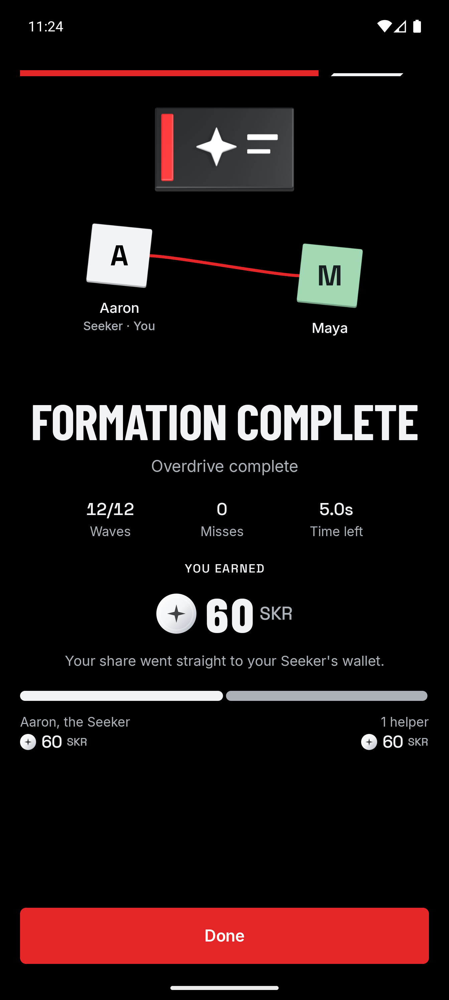

# Overdrive verification

Initial verification executed on 3 October 2026; confirmed testnet settlement added on 4 October 2026. Overdrive is registered as `overdrive`, vault code `6`, format version `1`, for exactly two players.

## Rules and integration

- All 124 Android host tests passed across 31 suites. Nine focused Overdrive tests cover paired scoring, shared misses, rejected inputs, deadline boundaries, private targets, deterministic replay, all difficulty presets, and per-player shape-match acceleration.
- The session test checks both opening and updated frames through the real host/client harness. Each recipient receives its projected state; the other games' default shared-state behavior remains available.
- Each correct shape catch increments that phone's match count. Its next pulse becomes faster even if its partner missed. An incorrect catch leaves its speed unchanged. A catch cannot change another pulse's deadline while it is falling.
- A focused Python regression test passed for parsing the current clue when the next-shape preview is present. An earlier driver failure came from treating the preview as the current clue.

## Builds

Android assembly and shared iOS simulator compilation passed:

```sh
cd app
./gradlew :androidApp:assembleDebug :shared:compileKotlinIosSimulatorArm64
```

Rule tests run with `:challenges:overdrive:testAndroidHostTest`; the complete host suite runs with `testAndroidHostTest`. The rule module was cleaned and rebuilt after a stale Kotlin incremental-compilation cache failed during the model change. No compiler configuration change was needed.

## Native two-phone journey

The final Android build passed the simulated journey on `emulator-5554` and `emulator-5556`:

```sh
FORMATION_REWARDS="$PWD/scripts/fixtures/overdrive.json" \
  scripts/e2e.py --title Overdrive --code 6 --chain simulated \
  --layout android --driver overdrive --no-build
```

The driver reads each phone's visible partner clue and taps the other dial. It completed 12 shared waves with zero misses, collected the seals, and unlocked the explicit 120 SKR simulated fixture. The host received 60 SKR; the wallet-free helper retained a 60 SKR claim-later entitlement. No production autopilot, hidden-answer reveal, or win bypass was added.

The host used its normal 448 dp display. The helper used 320 × 640 dp with 130% text size. Play screenshots were visually inspected: the counters, partner clue, pulse, dial, and controls remained visible. Lobby and outcome content outside the viewport was reached by scrolling. The helper's original resolution and text size were restored afterward.

The Android layout adapter starts the CLI's instrumentation server and uses its bundled protocol and serializer from a persistent Java process. This avoids restarting the runtime for each reflex-game observation. Repeated local reads measured approximately 16–20 ms after initialization. The adapter requires an installed Android CLI and JDK; `ANDROID_CLI_JAR` can select its `main.jar` explicitly. It is test tooling and is not included in the app.

Screenshots are saved under the ignored `program/target/e2e` directory: `seeker-overdrive-play.png`, `guest-overdrive-play.png`, `seeker-won.png`, and `guest-won.png`. The journey restores the previous ledger, wallet, and reward-fixture preferences; it retains the test's completed history and claim records.

## Confirmed testnet settlement — 4 October 2026

Overdrive uses the same Solana ledger and vault settlement flow as Ricochet. No game-specific payout implementation was needed. The documented journey now explicitly selects testnet instead of simulation.

The testnet Android APK built successfully, and all 13 Overdrive Android host tests passed. Two existing emulators ran the native game with the Android CLI layout reader. The first setup attempt stopped before provisioning because the guest's storage was still locked after cold boot. Waking the emulator and dismissing its ordinary lock screen resolved the setup failure; the subsequent complete journey passed.

The fixture funded 120 test tokens in the existing Formation vault with a 50/50 split. The helper recipient was bound before play. The driver read each phone's visible partner clue and rotated the other phone's dial through normal touch input. The phones completed 12 shared waves with zero misses and 5.0 seconds remaining, sealed the result, and settled both shares on Solana testnet.

```sh
FORMATION_REWARDS="$PWD/scripts/fixtures/overdrive.json" \
  python3 scripts/e2e.py --title Overdrive --code 6 --chain testnet \
  --wallet TESTNET_RECIPIENT --layout android --driver overdrive
```

The Android CLI reader used the installed JBR 21 runtime. The app's default ledger is Solana; the journey also explicitly selects it and restores prior ledger, wallet and fixture preferences afterwards. Omitting `--wallet` exercises a wallet-free guest whose share is reserved for a later claim rather than immediately paid.

| Property | Verified value |
| --- | --- |
| Network | Solana testnet |
| Program | `3AzZbKhGFcnaBRRenDDdNSdVumjKoXSkNHsPVeo5q6GW` |
| Configured test mint | `5npTBX2BhLoQcJ4vfx9o3Bc8aUnepBW67R9xuL6uhuWc` |
| Reward account | `26XhpUVgBH77VAdtfEfi3oYsyNvM8dwSvKA7CYL4Mstx` |
| Reward ID | `4e5dd477-11d3-4ca1-bcf2-d243510ae1a8` |
| Owner | `8YAmGLi231Zqw4u5D1FU7DvYsatrAf4vgiaDre8gRfwW` |
| Bound helper recipient | `9U7jMaMyBBdxxEp4zA5L8DgovQBPsdx6njY5EMXaxEMy` |
| Owner payout | 60,000,000 base units: 60 test tokens |
| Helper payout | 60,000,000 base units: 60 test tokens |
| Remaining escrow | 0 test tokens |

The [settlement transaction is confirmed on testnet](https://explorer.solana.com/tx/4JJevFeqdujnMcmd18pedPsGMHJ3r5nffCd2UsiVoiC9mJ3zQqraDH1Qfa1SLPY4NYECcnFDE62k5np91v7Qr94d?cluster=testnet). Verification checked the configured mint, retained tickets and transaction signature, committed roster root, successful transaction metadata, helper claim bit, and exact token deltas for both recipients. A subsequent read-only reconciliation confirmed vault code `6`, the unlocked account, the claimed helper slot, and zero tokens remaining in escrow.

The public verification record is saved under `program/target/e2e/settlement-4e5dd477-11d3-4ca1-bcf2-d243510ae1a8.json`. The native result capture below shows the host's completed round and reward split. The guest's payout text was visible, but its raw capture showed the previously documented emulator partial-frame rendering issue; the exact payment was independently confirmed from chain state.



The debug host signed with its installation claim key, and its eligibility used the configured test SGT group. These were real testnet transactions with test tokens that have no mainnet SKR value. This journey does not verify physical Seeker hardware or exercise a real Seeker wallet's signing UI.

## Remaining checks

Human communication and difficulty tuning need playtesting with two people. Physical Wi-Fi reliability, interrupted Overdrive sessions, real Seeker wallet signing, and iOS device play remain separate checks. The existing session-hardening tests and documentation cover shared recovery infrastructure; the 4 October journey verifies Overdrive's uninterrupted testnet settlement with a debug host and a bound helper recipient.
