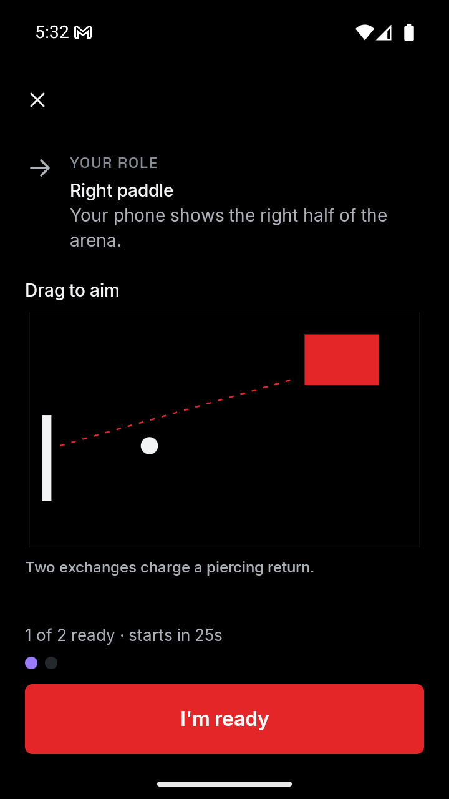
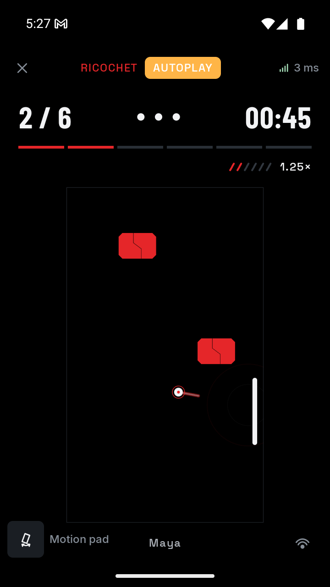
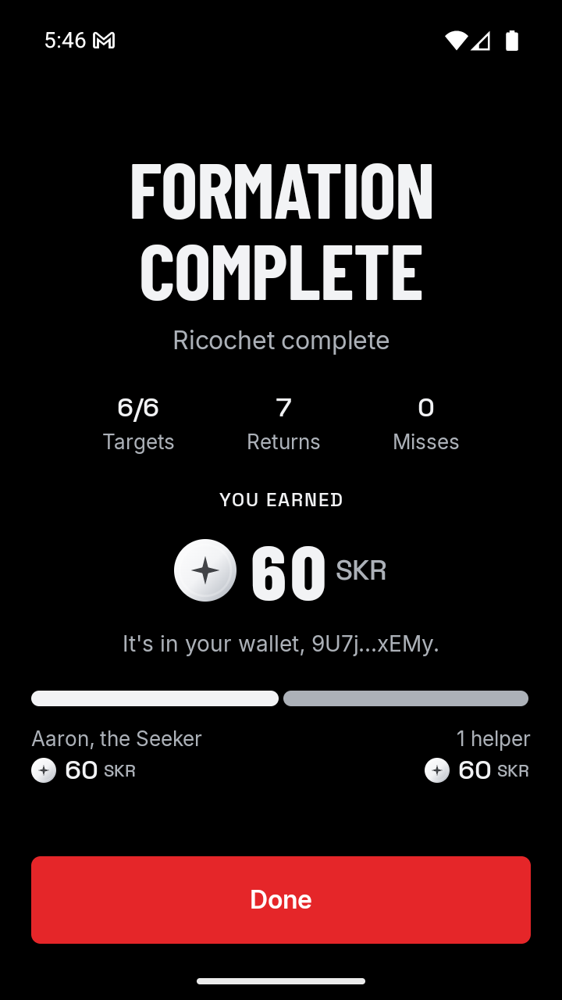

# Ricochet escalation verification

Executed on 4 October 2026 for `ricochet`, vault code `7`, format version `3`. The [implementation guide](ricochet.md) records the current rules; the [plan](ricochet-escalation-plan.md) records scope and acceptance.

## Automated checks

- All 160 Android host tests passed across 38 suites, including 27 Ricochet tests. The seeded completion check completes 32 rounds across the four difficulties through ordinary commands.
- Focused rule checks cover cooperative charging, one-target piercing followed by normal reflection, charge reset on a miss, matching predicted and guided trajectories, the 1.9× cap, and difficulty-specific speeds and deadlines. Existing admission, timing, collision, and completion checks remain passing.
- Feedback checks cover shared charge/pierce selection, event priority, deduplication, stale frames, and the existing last-life cadence. Release ledger-selection tests reject a persisted simulated choice; debug selection remains explicit.
- All 27 Ricochet iOS simulator tests passed. Android debug assembly, release lint, and shared iOS simulator Kotlin compilation passed.
- Four Python tests passed, including three chain-verification tests. They check mint-specific token deltas, newly created token accounts, failed or unconfirmed transactions, incorrect payout amounts, and two players binding the same wallet.

```sh
cd app
./gradlew testAndroidHostTest :androidApp:assembleDebug :androidApp:lintRelease \
  :shared:compileKotlinIosSimulatorArm64 :challenges:ricochet:iosSimulatorArm64Test
```

From the repository root:

```sh
python3 -m unittest discover -s scripts -p 'test_*.py'
```

## Aiming and charged return

Two emulators used the current debug APK. The host retained 1344 × 2992 at density 480; the guest temporarily used 720 × 1280 at density 320. A local wrapper moved the practice paddle through ordinary touch input before readiness and observed native charge playback during the round. No game state or result was injected.

The briefing's initial horizontal return missed the target. Moving the practice paddle below the fixed contact angled the return upward; the dotted line turned red and stopped at the target contact. On the compact guest, scrolling brought the complete preview into view while the ready action stayed accessible. The existing briefing and readiness sequence was retained.

During the first completed round, both phones accepted the authoritative charge cue and the following pierce cue. The compact guest showed the armed pulse with its red ring and trail at 1.25× momentum. Six targets cleared with eight returns and no misses. A later seeded round cleared six targets with six returns before charge activated. Charging requires two alternating exchanges; it is an earned rally peak, not a mandatory condition for winning.

| Compact aiming preview | Charged return |
| --- | --- |
|  |  |

The new charge and pierce assets are mono 48 kHz, 16-bit PCM, lasting 0.24 and 0.20 seconds. Both have zero endpoints; peak magnitudes are 5,814 and 6,797 of 32,767. Native logs establish accepted playback, not speaker quality or perceived latency.

## Confirmed testnet settlement

The existing deployed Formation program and test authority were inspected before provisioning. The network was Solana testnet. The test host held an SGT in the configured test group, and the fixture locked 120 test tokens with a 50/50 split. No deployment or mainnet transaction was performed in this pass.

| Property | Value |
| --- | --- |
| Program | `3AzZbKhGFcnaBRRenDDdNSdVumjKoXSkNHsPVeo5q6GW` |
| Configured test mint | `5npTBX2BhLoQcJ4vfx9o3Bc8aUnepBW67R9xuL6uhuWc` |
| Owner | `8YAmGLi231Zqw4u5D1FU7DvYsatrAf4vgiaDre8gRfwW` |
| Bound helper recipient | `9U7jMaMyBBdxxEp4zA5L8DgovQBPsdx6njY5EMXaxEMy` |
| First reward account | `5AZnqka1RmAEYheuPSvB1mKNeAZzTVnWvSXxNgUC6aWz` |
| First reward ID | `3105dabd-62b7-4920-96fc-f2932c39b554` |

The first unlock is [confirmed on testnet](https://explorer.solana.com/tx/3BVboE4yMCczjZugW2A9cwpp9LFiw46tCea6y3YizwSXFUayNkarABE1T3ofdLtGVUg3rshHvyiFg4WdTPh6akPD?cluster=testnet). Verification compared the saved tickets with the unlocked account, configured mint, committed roster root, claimed helper bit, retained signature, successful transaction metadata, and exact token deltas. The owner received 60,000,000 base units and the helper received 60,000,000 base units: 60 test tokens each. Neither receipt was simulated.

The compact guest's payout message initially remained below the fold. The journey now scrolls to the reward section before checking it. The first transfer was independently verified from the retained transaction, rather than treating the missing visible message as a chain failure.

A second sealed completion survived both apps being stopped by the verification wrapper. Relaunching reconciled and settled the saved win without replay or another signing identity. Its [confirmed testnet transaction](https://explorer.solana.com/tx/3zHVzqodCiJJrSVpf184CyExW5nL3BPRqBB6de8pvyN7PaPN2chHiaDsPhMfoR7bEAw6W3gik8Ji8SazYEj3GWGF?cluster=testnet) again paid exactly 60 test tokens to each recipient. The Android CLI reader now allows a bounded instrumentation-startup retry; failures remain explicit.

The final journey passed end to end after the tooling corrections. It practiced aiming on both phones, observed charging, cleared six targets with seven returns and no misses, sealed the result, displayed the compact guest's payout message, and verified [the confirmed transaction](https://explorer.solana.com/tx/2bamZwtnkzrMR18UHygyWou5f5YC7NX7KhyQXWbitLP4ZqpTfPY4hQXJFBMw1xzJv5NTMR5wpv6AcdHzaCjaoWPw?cluster=testnet). The journey selects an already visible reward before attempting carousel swipes.

The final reward account is `3QwM5L3EFRJTMwH7TxA76Nt45zFMYBMxmF3eYQC5rGK5`; its token escrow is `6UqekEB1T7RnWuEf8hcHwFkXrx9DEwapUu971s6o8jA4`. Each recipient received exactly 60 test tokens. Read-only reconciliation subsequently confirmed all three receipts and zero remaining tokens in each escrow.

The equivalent chain journey, without the local preview/screenshot wrapper, is:

```sh
FORMATION_REWARDS="$PWD/scripts/fixtures/ricochet.json" \
  python3 scripts/e2e.py --title Ricochet --code 7 --chain testnet \
  --wallet TESTNET_RECIPIENT --layout android --no-build
```



The debug host signs actual transactions with its installation claim key. The helper's test recipient is explicitly bound before play. This exercises real chain authorization and transfers, but does not attest Seeker hardware or exercise a physical Seeker's wallet signing UI. Test tokens have no mainnet SKR value. Signing material and signed transaction bytes remain outside documentation and logs.

Public verification records are saved under `program/target/e2e/settlement-<id>.json`. Ledger, wallet, and fixture preferences are restored after each journey; local completion and reward history remains. Both emulators' final display settings were verified as 1344 × 2992 at density 480, with no override remaining.

## Remaining checks

Two-person play still needs to establish comfortable aiming and reaction windows, how often charging occurs in ordinary play, and whether the peak is clear without sound. Physical Wi-Fi, interrupted signing/submission on a real wallet, speaker/haptic feel, and iOS native playback remain separate checks. Automated assistance establishes reachability and chain correctness, not enjoyment or hardware attestation. These checks remain on the [roadmap](ricochet-plan.md#roadmap).
