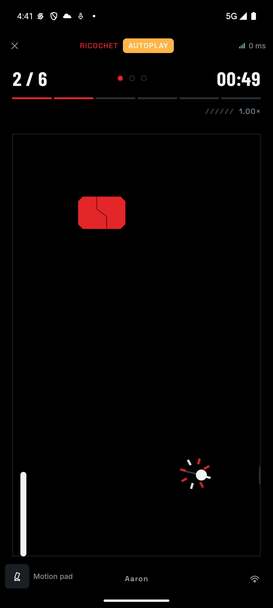
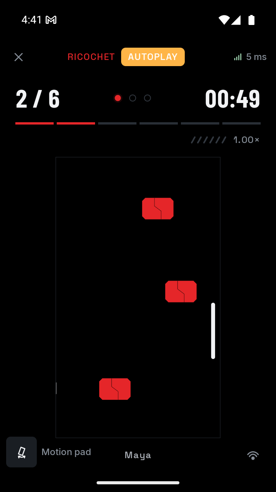

# Ricochet pressure verification

Executed on 4 October 2026 for `ricochet`, vault code `7`, format version `2`. This supplements the [initial format 1 verification](ricochet-verification.md).

## Automated checks

- All 153 Android host tests passed across 36 suites. Ricochet has 22 focused tests; the existing seeded completion check still completes 32 rounds across all four difficulties through ordinary paddle commands.
- New rule checks cover alternating acceleration, the cap on every difficulty, same-player target rebounds, acceleration within a swept step, matching bounded prediction, miss reset without restored targets, and authoritative close-call classification.
- Feedback checks cover restored/repeated/delayed events, return ownership, close-call and faster-return cues, coalesced event priority, last-life cadence, backward clock corrections, stale frames, serve preparation, completion, deadlines, and heartbeat suppression after recent impacts.
- A shared audio test confirms that challenge cues use the existing persisted mute gate, including a request muted before dispatch.
- All 22 Ricochet iOS simulator tests passed. Android debug assembly, shared iOS simulator compilation, and release lint passed.

```sh
cd app
./gradlew testAndroidHostTest :androidApp:assembleDebug :androidApp:lintRelease \
  :shared:compileKotlinIosSimulatorArm64 :challenges:ricochet:iosSimulatorArm64Test
```

These checks were executed in separate build invocations. The command combines them for reproduction.

## Two-emulator execution

Two simulated journeys passed on `emulator-5554` and `emulator-5556`, using the current APK and explicit Ricochet fixture:

```sh
FORMATION_REWARDS="$PWD/scripts/fixtures/ricochet.json" \
  python3 scripts/e2e.py --title Ricochet --code 7 --chain simulated \
  --layout android --no-build
```

The first journey used ordinary public-state debug assistance on both phones. It passed discovery, signed admission, readiness, play, both seals, and simulated settlement. Both full-size screen halves were visually inspected; the speed readout fitted below the target progress without overlapping the arena or footer.

The second journey used a temporary local wrapper around the existing driver. Assistance stayed off initially, and ordinary taps placed both paddles near the top. Two missed returns consumed two lives. Assistance then resumed through the normal debug controls, and the group cleared all six targets with six returns and two misses. Both seals and simulated settlement completed. No rule bypass or outcome injection was used.

During that second journey, the guest used 720 × 1280 at density 320. The host retained 1344 × 2992 at density 480. The last-life indicator, speed readout, arena, and footer fitted the compact viewport. Both displays below show two cleared targets and the reset 1.00× momentum after the misses.

| Host | Compact guest |
| --- | --- |
|  |  |

The guest's original display size and density were restored and verified afterward. The journey restored its ledger, wallet, and fixture preferences. Its local completion and reward history remains, as with the existing driver. The fixture supplied 120 simulated SKR split 60/60; no on-chain transfer occurred.

## Audio observations

Debug native logs reported successful decoding of all six new cues on both emulators. The first journey accepted ordinary return and target playback, followed by the existing completion and reward cues. The second accepted two miss cues on each phone, four last-life cues on the host, five on the guest, and two faster-return cues on the guest. Heartbeat gaps were approximately 2.4 seconds or multiples of that interval when an impact took priority. These logs establish accepted native playback, not perceived sound quality.

The six original assets total 117,384 bytes. Their mono 48 kHz, 16-bit PCM headers, zero endpoints, clipping headroom, and DC level were checked. Peak sample magnitudes stay below 29% of full scale; absolute DC is below 0.5% of RMS amplitude. Regenerating them with `python3 assets/sound/gameplay.py` is deterministic.

Close-call classification and cue selection are covered by focused tests. This pass did not deliberately produce a close-call sound on a physical phone, test iOS playback, or assess speaker timbre, haptic strength, Bluetooth delay, or comfortable human reaction times.

After the emulator journeys, final review added a high-water guard so a backward host-clock correction cannot replay the previous heartbeat interval. The extended feedback test, all 22 Ricochet Android/iOS tests, and a final Android rebuild passed. The clock-regression case was checked in unit tests, not induced on the emulators.

## Follow-up

The [roadmap](ricochet-plan.md#roadmap) retains physical Wi-Fi and interruption tests, two-person pacing, and device audio/haptic evaluation. The 8% increase and 1.5× cap are initial tuning values. Charged pulses, armour, and moving targets remain separate experiments after that playtest.
