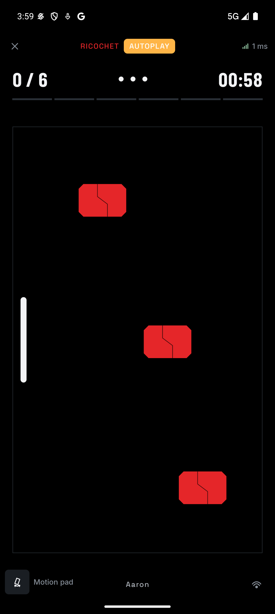
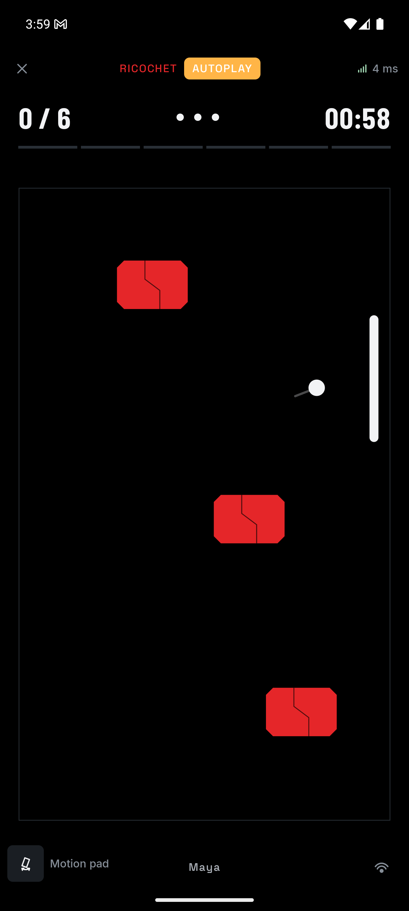
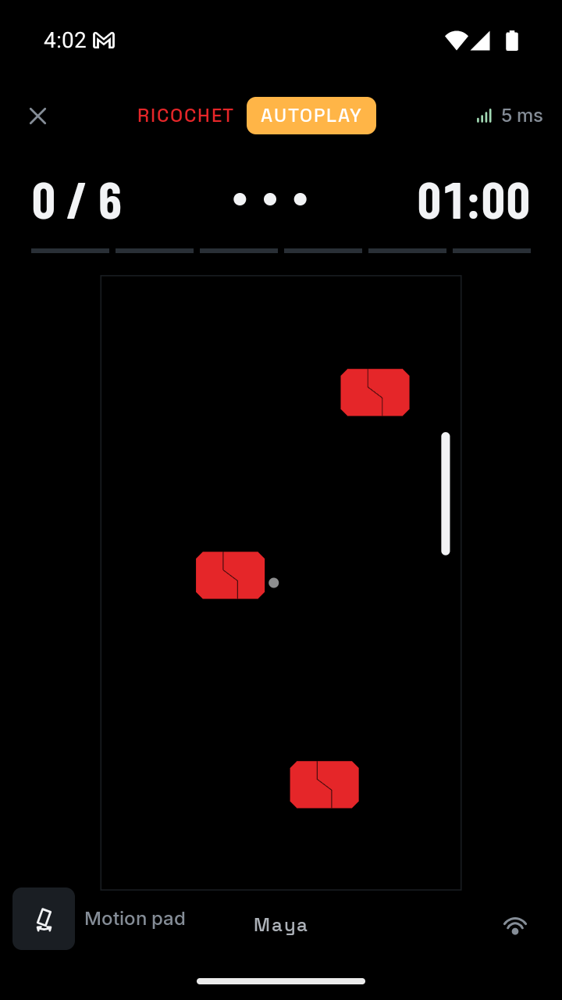

# Ricochet verification

Executed on 4 October 2026. Ricochet is registered as `ricochet`, vault code `7`, format version `1`, for exactly two players.

This records the first implementation. See the [pressure-pass verification](ricochet-pressure-verification.md) for the current format version 2.

## Automated checks

- All 143 Android host tests passed across 34 suites, including 13 focused Ricochet tests.
- The Ricochet tests cover swept target contact, paddle angles and conserved speed, seamless crossing, wall reflection, escapes, finite and sequenced input admission, deterministic replay across tick cadences, miss resets, frozen outcomes, and the two-player roster requirement.
- Presentation tests cover the 100 ms prediction limit, immutable authoritative state, and touch reconciliation with delayed acknowledgements and unsent drag positions.
- The completion test plays 32 seeded rounds through ordinary commands across Easy, Normal, Hard, and Extreme. A separate defensive run verifies the deadline with targets still standing, followed by rejected post-deadline input.
- All 13 Ricochet iOS simulator tests passed. Android assembly, shared iOS simulator compilation, and Android release lint passed.
- The existing Python driver regression test passed after the shared autoplay helper was extracted.

```sh
cd app
./gradlew testAndroidHostTest :androidApp:assembleDebug :androidApp:lintRelease \
  :shared:compileKotlinIosSimulatorArm64 :challenges:ricochet:iosSimulatorArm64Test
```

These tasks were executed in separate build invocations during the implementation phases. The command above combines the verified checks for reproduction.

## Two-emulator execution

Three simulated journeys passed on `emulator-5554` and `emulator-5556`. They exercised discovery through the existing emulator bridge, signed admission, readiness, synchronized play, completion, both seals, and simulated unlock.

```sh
FORMATION_REWARDS="$PWD/scripts/fixtures/ricochet.json" \
  python3 scripts/e2e.py --title Ricochet --code 7 --chain simulated \
  --layout android --no-build
```

The explicit fixture supplies 120 simulated SKR, split 60/60. The host showed its settled share; the wallet-free guest reached the earned-reward state. This is simulated settlement, not a chain transfer.

The first run cleared all six targets with seven returns and no misses. A second run captured the unobstructed left and right arenas. The debug assistance uses published state and submits ordinary paddle positions; the stage displays **AUTOPLAY** while it is active.

| Left half | Right half |
| --- | --- |
|  |  |

The third journey temporarily changed the guest to 720 × 1280 at density 320, while the host retained 1344 × 2992 at density 480. The arena fitted within the shorter display without clipping the HUD, targets, paddle, or footer. This also exercised two differently sized viewports in one session. The guest's original display settings were restored afterward.



During that journey, host assistance was disabled temporarily. A tap at logical height 0.35 moved the paddle upward; a vertical swipe ending at 1.35 moved it downward. Screenshots taken after release showed the corresponding paddle positions. Assistance was then restored and the formation completed through normal scoring and settlement. The extra touch-check harness was temporary; the repository's journey supports `--driver manual` for human play.

## Limits of these checks

Autopilot completion establishes reachable targets and integration with the session flow. It does not establish enjoyable difficulty, comfortable touch sensitivity, or human reaction times. Haptic feel, perceived sound timing, and bezel continuity need physical phones.

The verified journeys used a local emulator bridge and simulated rewards. They did not exercise a physical Wi-Fi network, hotspot transitions, deliberate disconnects during Ricochet, or on-chain settlement for this game. Those items remain in the [roadmap](ricochet-plan.md#roadmap).
