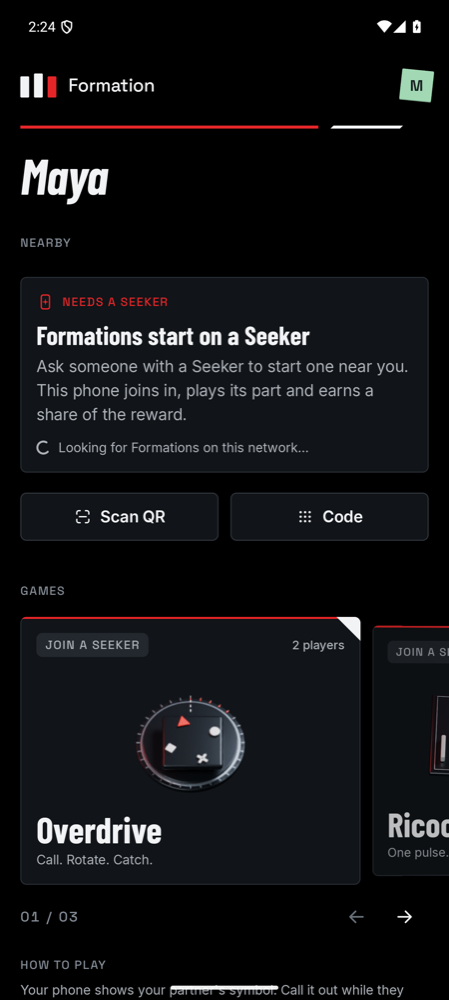
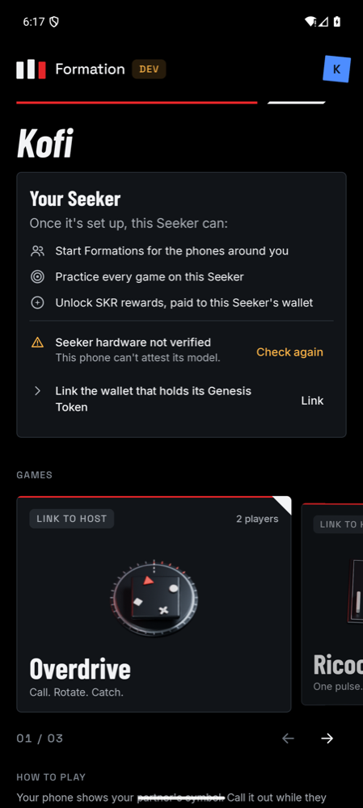
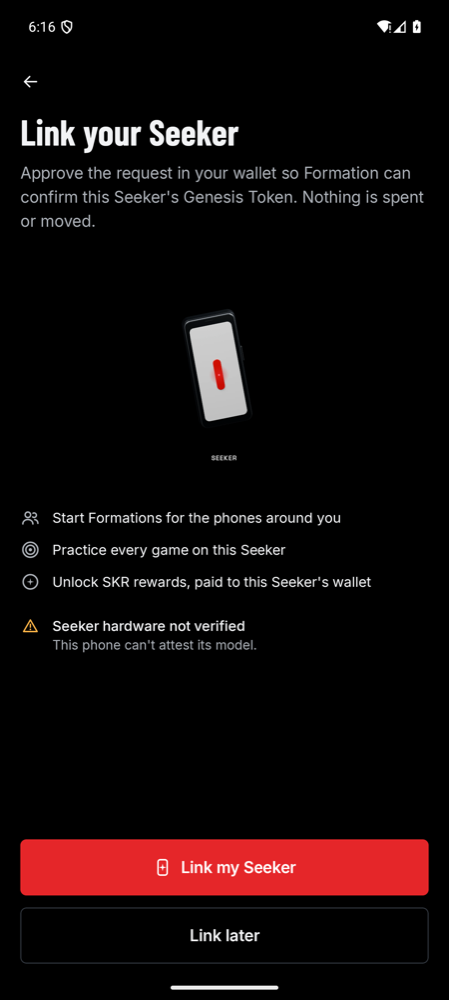
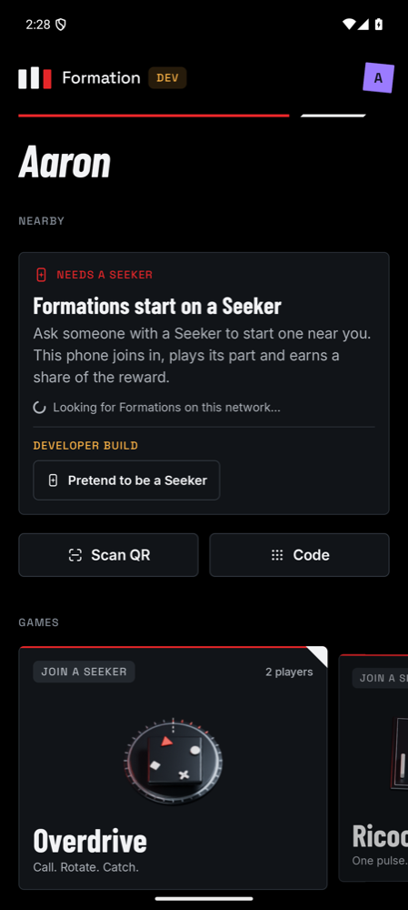

# Seeker and player paths

Formation has two paths through the app. On the release path a real Seeker must be in the room to play and to earn rewards. The developer path plays without one, so the app can be built and tested on any phone or emulator.

## Two flavors

| Flavor | Installs as | Seekers | Developer tools |
| --- | --- | --- | --- |
| `dev` | **Formation Dev** (`xyz.mcxross.formation.dev`), beside the release app | Any phone can pretend to be one. Other `dev` builds accept its simulated proof. | A **DEV** tag on Home, **Pretend to be a Seeker**, **Act as Seeker hardware**, the simulated ledger, simulated motion on emulators and game autoplay |
| `prod` | **Formation** (`xyz.mcxross.formation`) | Only a real Seeker hosts, and every phone checks its [hardware proof](seeker-presence.md) | None in the interface. A saved simulated-ledger choice or pretend Seeker is ignored. |

Each flavor builds as debug or release. Daily work and the emulator journeys use `devDebug`. Release CI builds `prodRelease` and refuses an APK whose package isn't the `prod` one. `prodDebug` behaves like the store app but stays debuggable, so it is the build to install when checking a real Seeker.

## What each phone sees

The app reads the phone's build properties to choose a layout. Hosting still needs the hardware proof and a linked wallet, so a phone that only looks like a Seeker can't host.

| | Phone that isn't a Seeker | Seeker | `dev` build pretending |
| --- | --- | --- | --- |
| Onboarding | Story, then profile, then Home | Story, profile, then **Link your Seeker**: what the Seeker unlocks, its hardware check and the wallet link | As the phone it runs on |
| Home opens on | **Nearby**. Until a Formation appears, a panel explains that Formations start on a Seeker and how to join one | **Your Seeker** while anything is left to set up (hardware verified, wallet linked, a reward funded), then its games | Its games, tagged **Test host** |
| Game cards | **Join a Seeker** | **Link to host**, **No reward** or **Playable** | **No reward** or **Playable** |
| Game sheet | How to play, and "You play this with a Seeker" | Practice once the hardware and wallet check out; otherwise what's missing, with **Link this Seeker** | Practice |
| Settings | "Not a Seeker. This phone can join any Formation." | Wallet link and the hardware check | Developer section |

A wallet linked on a phone that isn't a Seeker, before hosting needed the hardware proof, stays linked for rewards. Home tells that phone it isn't a Seeker.

## Developer tools

- **Pretend to be a Seeker**, from Home's Nearby panel or Profile → Developer, makes the phone a test Seeker that hosts with its claim key.
- **Act as Seeker hardware**, in Profile → Developer, shows a Seeker's onboarding and setup on any phone after a restart. Its hardware check still fails off a real Seeker, which is how the screenshots above were taken.
- **Solana ledger** off switches to simulated rewards. The emulator journeys seed rewards through `FORMATION_REWARDS`.

## Joining without internet

The host used to look up each joining phone's name before greeting it. That reverse DNS lookup stalled every join for about 30 seconds on a network without DNS, such as the Seeker's own hotspot. The host now records the address without a lookup, and a guest on an emulator without internet joins in under 100 ms.

## Verification

Verified on 5 October 2026 on two Android 16 emulators:

- The `prod` build on a phone that isn't a Seeker opened on the Nearby panel, tagged games **Join a Seeker**, explained the Seeker in the game sheet, and had no Developer section, pretend option or hardware switch in Settings.
- The `dev` build showed the **DEV** tag and the pretend button. Pretending switched Home to the test Seeker layout. **Act as Seeker hardware** produced the Seeker setup and onboarding screens, with the emulator's hardware check failing as expected.
- Ricochet's simulated duo journey passed on the `dev` flavor: join, play, seal and unlock.
- 227 host tests, `prodRelease` lint, both debug flavors and the shared iOS compile passed.

## Open questions

- A Seeker can only host a group when a sponsor has funded a reward for it. Without one it can practice but not play with others. Group play without a reward would need a session that isn't tied to a reward.
- iOS is unchanged and still always takes the developer path.
