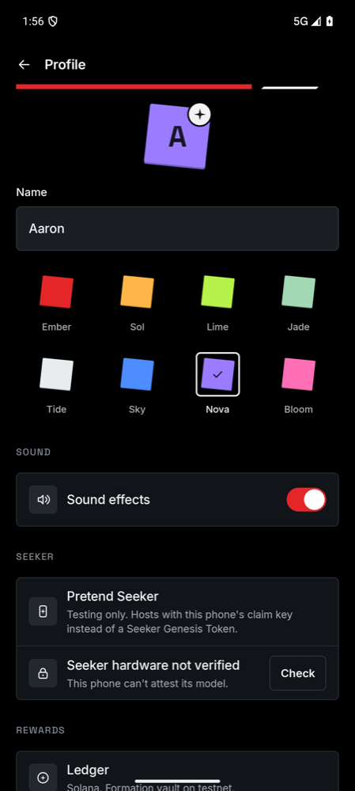

# Seeker presence

Only a Seeker can host a Formation, and a Formation's games only run with that Seeker present. A Seeker Genesis Token alone can't show that, so the phone that hosts now proves it is a Seeker with its secure hardware, and every phone that joins checks the proof itself.

## Why a Genesis Token isn't enough

Solana Mobile documents two ways to recognise Seeker users ([Detecting Seeker users](https://docs.solanamobile.com/recipes/general/detecting-seeker-users), [Seeker Genesis Token](https://docs.solanamobile.com/marketing/engaging-seeker-users)):

- **Build constants** (model `Seeker`, manufacturer `Solana Mobile Inc.`, brand `solanamobile`). The docs warn that these can be spoofed. Formation only uses them to choose the onboarding path.
- **Genesis Token checks.** The wallet holds a token in group `GT22s89nU4iWFkNXj1Bw6uYhJJWDRPpShHt4Bk8f99Te`, the user signs a message to prove they control the wallet, and the token's mint is tracked because the token can move between a user's wallets.

Both show who owns a Seeker, not that the phone running Formation is one. A Seed Vault recovery phrase, or a token moved to another wallet, works from any phone. Solana Mobile doesn't publish an API that proves a device is present. Android key attestation does: a phone's secure hardware signs a statement about the key it holds and the phone it is in, and that statement chains to Google's attestation roots.

## Linking: the owner proves the wallet

Linking asks the wallet to sign a one-time message through Mobile Wallet Adapter. Formation checks the Ed25519 signature against the wallet's address before it looks up the Genesis Token on mainnet. A wallet app that reports someone else's address can't sign for it, so it can't link.

## Hosting: the Seeker proves the phone

When a Seeker starts a Formation, before it ends any current session:

1. It creates an Ed25519 session key in memory.
2. It creates a P-256 key in Android Keystore with the attestation challenge `SHA-256("formation.seeker.v1\n" + session + "\n" + session key)`. It also sets `setDevicePropertiesAttestationIncluded(true)`, so the secure hardware writes the phone's brand, manufacturer and model into the attestation. Formation keeps the certificate chain and deletes the key.
3. It checks its own chain with the rules every guest applies, so a refusal is explained on the Seeker itself.
4. It sends the chain and the session key in its admission challenge. It then signs every welcome and every session snapshot with the session key.

A phone that fails is told why, for example "Only a Seeker can host. The phone is a Google Pixel 9 Pro, not a Seeker." Home shows the same reason to a linked owner whose phone can't prove itself.

## Joining: every phone checks the Seeker

The chain rules follow Google's [reference verifier](https://github.com/android/keyattestation). Google's [key attestation guide](https://developer.android.com/privacy-and-security/security-key-attestation) says the check belongs off the attested device, and here every joining phone does it.

| Check | Rule |
| --- | --- |
| Root | Trust comes from Google's two pinned root keys, never from the root the device sends. The RSA root `serialNumber=f92009e853b6b045` was reissued in 2016, 2019, 2021 and 2022 with one key. The EC root `Key Attestation CA1` is used from February 2026. |
| Path | Each certificate is issued by, and signed with, the one above it. Only the leaf may carry an attestation record. |
| Dates | Intermediates must be within their validity. Factory-provisioned chains keep expired intermediates, as Google allows. |
| Revocation | No certificate is on Google's [revocation list](https://android.googleapis.com/attestation/status). Each phone fetches its own copy, refreshes it daily and keeps it for offline play. A phone that has never fetched it refuses to join. |
| Hardware | The key was generated in a TEE or StrongBox, and a StrongBox claim must match the chain. |
| Session | The challenge matches this Formation's session and session key. |
| Boot | The bootloader is locked and verified boot reports `Verified`. |
| Seeker | The hardware-attested brand, manufacturer and model are `solanamobile`, `Solana Mobile Inc.` and `Seeker`. Case is ignored. |
| App | The key was made by `xyz.mcxross.formation`. On Android it must be signed with the same certificate as the joining phone's copy. |

After the proof checks out, the phone sends a fresh nonce in its hello. The Seeker's welcome must echo that nonce, signed by the session key. Snapshots without a valid signature end the session with "The Seeker's updates couldn't be verified." A welcome or snapshot that arrives unsigned is ignored.

## Practice

Practice runs on the Seeker alone, so the game sheet proves this phone with the same check before it opens a game's interactive introduction. Settings → Seeker → **Check** runs the check on demand and shows the verdict.

## Debug builds

**Pretend to be a Seeker** sends a simulated proof that has no certificate chain. Only debug builds accept it, so emulator journeys still run, and a release build refuses it with "This host is a test Seeker from a developer build."

## What this stops

| Attempt | Result |
| --- | --- |
| Any phone links a wallet that holds a Genesis Token | It can't host: the attestation names its real model, or the phone can't produce one |
| A wallet app reports someone else's Genesis Token address | Linking fails: the signature doesn't match the address |
| Spoofed build properties, or a rooted or unlocked Seeker | The model and boot state come from the secure hardware |
| Replaying a Seeker's earlier proof | The challenge commits to one session and a key the replayer doesn't hold |
| Relaying a real Seeker's proof into a Formation another phone runs | That phone can't sign the welcome or snapshots with the Seeker's session key |
| Changing session state on the network | Snapshot signatures fail and the guest leaves |
| A rebuilt copy of Formation on a Seeker | Its signing certificate differs from the guest's |

## Limits

- **Real Seekers haven't been tested yet.** If the Seeker can't attest its device properties (`CANNOT_ATTEST_IDS`), or attests different strings from the documented build constants, hosting fails closed with that reason. Run Settings → Seeker → **Check** on a Seeker before a release.
- **iPhones skip the signing-certificate check.** Until the release certificate's SHA-256 is pinned for them, iPhone guests check everything else but not the certificate. No signed release exists yet to take it from.
- **Distance isn't measured.** A real Seeker can host from elsewhere if its traffic is relayed. The Seeker must still run the session itself.
- **Leaked attestation keys** are stopped only once Google revokes them.
- **Game frames aren't signed.** Live game state (around 30 per second) isn't signed. Results arrive in snapshots, which are.
- **The vault program can't see the proof.** It trusts the Seeker's wallet signature (see Trust boundaries in the [README](../README.md#trust-boundaries)).

## Verification

Verified on 5 October 2026:

- **Host tests (224, all passing).** The chain verifier runs against Google's published test chains from a Pixel 9 Pro, a Pixel 8a, a Pixel StrongBox key and a Sony Xperia 10 III. These cover both roots, remote and factory provisioning, an unlocked bootloader, expiry, revocation, tampering, reordering and a malformed record. Policy tests cover other phones, modified systems, other sessions, apps and signers, and test Seekers. Session tests cover a host without proof, a copied proof, altered updates and stripped signatures. Linking tests cover a wallet that names an address it can't sign for.
- **iOS simulator.** The same chain tests pass through the Security framework.
- **Release lint and debug assembly** pass.
- **Two-phone journey.** Ricochet's simulated duo ran on two Android 16 emulators: a debug pretend Seeker hosted, the guest checked its proof and signed updates, and they played, sealed and unlocked.
- **Release refusal.** A release build, signed locally with the debug key, refused to join that pretend Seeker:

  

- **Emulator hardware check.** Android's emulator refuses to attest device properties (`CANNOT_ATTEST_IDS`), so Settings reports the phone as unverified and hosting stays closed:

  

Not yet exercised: a real Seeker's attestation, wallet sign-in through Seed Vault, and an iPhone joining a real Seeker.
